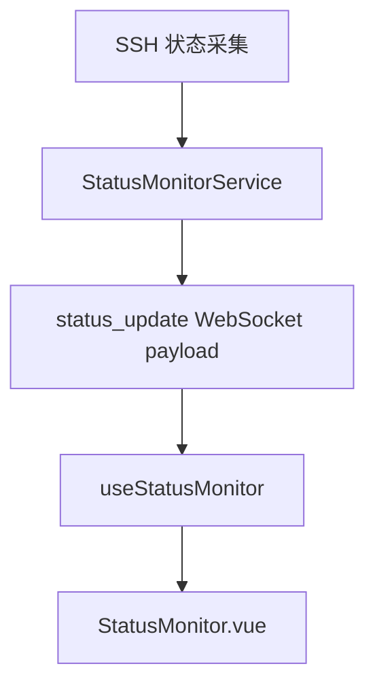

# 变更提案: server-status-cpu-core-display

## 元信息
```yaml
类型: 优化
方案类型: implementation
优先级: P2
状态: 执行中
创建: 2026-04-12
```

---

## 1. 需求

### 背景
当前工作区右侧状态监控已经展示 CPU 型号、CPU 使用率、内存、磁盘和网络信息，但无法直观看到服务器 CPU 是几核。用户希望在当前页面直接判断机器规格，无需再登录服务器执行 `nproc` 或 `lscpu`。

### 目标
- 在服务器状态数据中补充 CPU 核心数字段。
- 在 `StatusMonitor.vue` 中把 CPU 核心数放到 CPU 型号下方，直接显示为类似 `16 核` 的次级信息。
- 保持现有状态监控布局和 WebSocket 链路不变，只做增量增强。

### 约束条件
```yaml
时间约束: 当前轮次内完成实现与构建验证
性能约束: 不额外引入持续高频采集逻辑，仅复用现有状态轮询时机
兼容性约束: 状态数据新增字段必须保持向后兼容，字段缺失时前端优雅降级为 N/A
业务约束: 保持状态监控现有暗色仪表风格，不重构已有卡片和图表布局
```

### 验收标准
- [ ] 后端状态采集结果包含 `cpuCores`，能在 Debian 12 等常见 Linux 环境下稳定读取逻辑核心数。
- [ ] 前端状态监控页在 CPU 型号下方展示 CPU 核心数，字段缺失时显示 `N/A`。
- [ ] `packages/frontend` 与 `packages/backend` 构建通过。

---

## 2. 方案

### 技术方案
后端在 `StatusMonitorService` 中复用现有 SSH 执行链路采集 CPU 核心数，优先使用 `nproc`，失败时回退到 `getconf _NPROCESSORS_ONLN` 与 `lscpu` 解析，最终将结果写入新增的 `cpuCores` 字段。前端扩展 `ServerStatus` 类型和状态监控多语言文案，在 `StatusMonitor.vue` 的 CPU 型号行内改为“主值 + 次级 badge”布局，使 CPU 核心数直接显示在 CPU 型号下方，并保持窄屏下可自然换行。

### 影响范围
```yaml
涉及模块:
  - backend: 扩展状态采集结果，新增 CPU 核心数采集逻辑
  - frontend: 扩展状态类型、状态监控文案和 CPU 信息展示
  - knowledge-base: 同步前后端模块说明与变更记录
预计变更文件: 9
```

### 风险评估
| 风险 | 等级 | 应对 |
|------|------|------|
| 部分精简系统缺少 `nproc` 或 `lscpu` | 低 | 采用多级回退命令，无法获取时返回 `undefined` 由前端降级 |
| CPU 型号文案较长导致布局拥挤 | 低 | 维持现有 `truncate` 主行，核心数改为独立次级 badge 并允许换行 |

---

## 3. 技术设计（可选）

> 涉及架构变更、API设计、数据模型变更时填写

### 架构设计


### API设计
#### WebSocket `status_update`
- **请求**: 由前端现有状态订阅链路触发，无新增请求参数
- **响应**: `payload.status` 新增可选字段 `cpuCores?: number`

### 数据模型
| 字段 | 类型 | 说明 |
|------|------|------|
| `cpuCores` | `number` | 服务器可用的逻辑 CPU 核心数，采集失败时缺省 |

---

## 4. 核心场景

> 执行完成后同步到对应模块文档

### 场景: 工作区状态监控查看 CPU 规格
**模块**: frontend / backend
**条件**: 用户已在工作区打开活动 SSH 会话，右侧状态监控正常接收服务器状态。
**行为**: 后端通过现有 SSH 采集链路读取 CPU 核心数并随 `status_update` 推送；前端在 CPU 型号行下方显示如 `16 核` 的次级信息。
**结果**: 用户无需登录服务器执行命令，即可在状态监控页直观看到当前服务器 CPU 核数。

---

## 5. 技术决策

> 本方案涉及的技术决策，归档后成为决策的唯一完整记录

### server-status-cpu-core-display#D001: 复用现有状态流增量展示 CPU 核心数
**日期**: 2026-04-12
**状态**: ✅采纳
**背景**: 用户只要求在现有状态监控页直观看到 CPU 是几核，不需要新页面或独立接口，但现有状态采集结果没有此字段。
**选项分析**:
| 选项 | 优点 | 缺点 |
|------|------|------|
| A: 在现有 `status_update` 中新增 `cpuCores` 并在 CPU 型号下方展示 | 改动链路短、向后兼容、最符合用户“直观看到”的诉求 | 需要同时修改前后端和多语言文案 |
| B: 新增独立接口或额外系统信息区展示 | 字段职责更分离 | 实现更重，增加状态来源和 UI 冗余 |
**决策**: 选择方案 A
**理由**: 当前状态监控已经承载 CPU 型号和使用率，把 CPU 核心数作为同一组信息的次级字段展示最直接，也不会引入新的请求或页面结构。
**影响**: 影响 `packages/backend/src/services/status-monitor.service.ts`、`packages/frontend/src/types/server.types.ts`、`packages/frontend/src/components/StatusMonitor.vue` 及对应 locale 文案。

---

## 6. 成果设计

> 含视觉产出的任务由 DESIGN Phase2 填充。非视觉任务整节标注"N/A"。

### 设计方向
- **美学基调**: 延续当前状态监控面板的暗色运行态仪表风格，只做密度增强，不改变现有层级和卡片语言。
- **记忆点**: CPU 型号下方增加一个小尺寸规格 badge，让“型号 + 核数”形成一组可快速扫读的硬件信息。
- **参考**: 参考当前 `StatusMonitor.vue` 的内存/磁盘卡片视觉语言和 CPU 型号文本层级。

### 视觉要素
- **配色**: 延续现有状态行文本配色，badge 使用与监控卡片一致的低饱和边框和深色底。
- **字体**: 继承当前页面现有字体体系，核心数值使用现有中号半粗文本层级，不引入新的字体依赖。
- **布局**: CPU 型号主值保持单行截断，核心数作为其下方独立次级行展示，窄屏时允许自然折行。
- **动效**: 无新增独立动效，保持现有状态监控的稳定刷新体验。
- **氛围**: 保持现有暗色面板和轻微描边质感，不增加额外装饰性元素。

### 技术约束
- **可访问性**: 核心数字段缺失时必须显示 `N/A`，避免空白状态；文本对比度沿用当前状态面板规范。
- **响应式**: 在现有 `StatusMonitor.vue` 响应式规则下工作，不新增独立断点。
