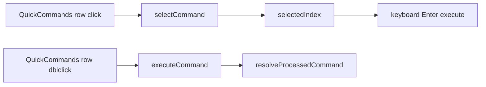

# 变更提案: quickcommands-double-click-tooltip

## 元信息
```yaml
类型: 优化
方案类型: implementation
优先级: P1
状态: 已完成
创建: 2026-04-12
完成: 2026-04-12
```

---

## 1. 需求

### 背景
当前工作台中的快捷命令列表在鼠标单击时会立即执行命令。这个交互对频繁浏览和筛选命令的场景过于敏感，容易在仅想选中或查看命令时误触执行。与此同时，列表中的命令文本在部分模式下会被截断，用户无法通过 hover 直接看到完整命令内容。

### 目标
- 将快捷命令列表的鼠标主交互改为“单击选中、双击执行”。
- 保留键盘 `Enter` 执行和右键菜单“立即执行”能力，避免回退已有高效入口。
- 在鼠标悬停快捷命令项时显示完整命令，便于长命令核对。

### 约束条件
```yaml
时间约束: 本轮内完成前端交互改造与基础构建验证
性能约束: 不新增依赖，不引入额外全局状态
兼容性约束: 保持现有快捷命令键盘导航、右键菜单动作和动态变量解析链路不回退
业务约束: 仅收紧鼠标列表项执行方式；用户确认保留键盘 Enter 与右键“立即执行”
```

### 验收标准
- [ ] 快捷命令列表项鼠标单击不再直接执行，而是只更新当前选中态
- [ ] 快捷命令列表项鼠标双击后仍可向当前活动 SSH 会话执行处理后的命令
- [ ] 键盘 `Enter` 执行与右键菜单“立即执行”能力保持可用
- [ ] 鼠标悬停任意快捷命令项时可看到完整命令内容
- [ ] `packages/frontend` 的构建验证通过

---

## 2. 方案

### 技术方案
继续在 `QuickCommandsView.vue` 内做最小改动，不拆分新组件。将列表项绑定从单击执行调整为单击设置选中项、双击触发原有 `executeCommand()`；新增一个轻量选择函数，根据当前 `flatVisibleCommands` 反查并写入 `selectedIndex`，确保键盘 `Enter` 仍复用既有选中执行逻辑。完整命令展示直接通过列表项 `title` 属性承载，沿用浏览器原生 tooltip，不新增额外浮层状态。

### 影响范围
```yaml
涉及模块:
  - frontend: `QuickCommandsView.vue` 的列表项点击行为与 tooltip 展示
  - frontend: 快捷命令选中态与键盘执行的联动验证
预计变更文件: 1-3
```

### 风险评估
| 风险 | 等级 | 应对 |
|------|------|------|
| 双击执行后，单击选中态与现有键盘导航索引不一致 | 中 | 统一通过 `selectedIndex` 维护选中态，单击先显式写入对应索引 |
| 列表项新增 tooltip 后与按钮自带 `title` 提示冲突 | 低 | 仅在行容器挂载完整命令 title，按钮级 title 保持局部动作提示 |
| 改动鼠标执行手势后影响右键菜单和动态变量执行链路 | 低 | 不改 `executeCommand()` 与菜单动作实现，仅调整触发入口 |

---

## 3. 技术设计（可选）

### 架构设计


### 数据模型
| 字段 | 类型 | 说明 |
|------|------|------|
| `selectedIndex` | `number` | 当前快捷命令在 `flatVisibleCommands` 中的选中索引 |
| `cmd.command` | `string` | 列表项 hover 时展示的完整命令内容 |

---

## 4. 核心场景

### 场景: 单击快捷命令仅选中
**模块**: frontend
**条件**: 用户在工作台快捷命令列表中单击某条命令。
**行为**: 组件仅更新当前选中项高亮，不立即向活动会话发送命令。
**结果**: 用户可以先浏览、对比或配合键盘 `Enter` 再决定是否执行。

### 场景: 双击快捷命令立即执行
**模块**: frontend
**条件**: 用户在工作台快捷命令列表中双击某条命令，且当前存在活动 SSH 会话。
**行为**: 组件沿用现有命令处理链路，解析动态变量后向当前活动会话执行命令。
**结果**: 鼠标执行操作改为更明确的双击确认动作。

### 场景: hover 查看完整命令
**模块**: frontend
**条件**: 快捷命令名称或命令文本过长，列表中出现截断显示。
**行为**: 鼠标移动到命令项上时，浏览器原生 tooltip 展示完整命令字符串。
**结果**: 用户无需编辑或复制，即可直接核对完整命令内容。

---

## 5. 技术决策

### quickcommands-double-click-tooltip#D001: 使用“单击选中 + 双击执行 + 原生 title tooltip”，而不是引入自定义气泡组件
**日期**: 2026-04-12
**状态**: ✅采纳
**背景**: 用户要求避免快捷命令误触执行，并在 hover 时直接看到完整命令；现有列表已经有选中态和键盘执行能力。
**选项分析**:
| 选项 | 优点 | 缺点 |
|------|------|------|
| A: 单击选中、双击执行，完整命令走原生 `title` | 改动最小，兼容现有选中态和键盘执行，无需新增依赖或状态 | tooltip 样式受浏览器控制，可定制度低 |
| B: 保持单击执行，额外增加确认弹层或自定义 tooltip | 视觉上更可控 | 误触问题没有真正消除，交互和实现都更重 |
**决策**: 选择方案A
**理由**: 该需求本质是降低误触风险并补齐信息可见性，现有列表已经具备选中高亮与键盘执行语义，直接复用最稳妥。
**影响**: frontend

---

## 6. 成果设计

### 设计方向
- **美学基调**: 延续现有工作台深色工具型列表，不引入新的视觉层级，仅修正交互手势
- **记忆点**: 命令项保持现有高亮风格，但 hover 时能直接看到完整命令
- **参考**: 当前 `QuickCommandsView.vue` 列表样式与系统原生 tooltip

### 视觉要素
- **配色**: 沿用现有主题变量和选中高亮，不新增色彩体系
- **字体**: 沿用当前命令列表字体体系，命令文本继续使用 monospace 呈现
- **布局**: 保持现有分组与扁平列表布局不变
- **动效**: 继续沿用现有 hover/selected 过渡，不新增动画
- **氛围**: 保持深色工作台的克制工具感，以交互调整替代视觉重绘

### 技术约束
- **可访问性**: 单击选中后需保持现有高亮反馈，便于键盘 `Enter` 执行路径延续
- **响应式**: 继续兼容紧凑模式与普通模式下的截断显示
