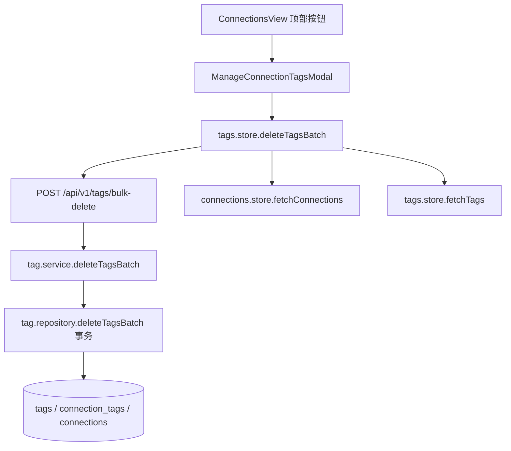

# 变更提案: connections-tag-batch-management

## 元信息
```yaml
类型: 新功能
方案类型: implementation
优先级: P1
状态: 已确认
创建: 2026-04-12
```

---

## 1. 需求

### 背景
当前 `/connections` 页面已经支持按标签树筛选连接，也有单标签关联管理能力，但缺少面向标签本身的集中批量管理入口。用户需要在连接页直接批量处理标签，尤其是批量删除标签，并在删除时决定标签下的连接是一起删除还是仅移除标签归入“未标记”。

### 目标
- 在 `ConnectionsView.vue` 顶部工具条新增“标签管理”入口，使用弹窗承载标签批量操作。
- 支持对多个标签进行勾选、多选、搜索和批量删除。
- 删除标签时支持两种策略：一并删除关联服务器，或仅删除标签并将关联服务器归入“未标记”。
- 删除完成后同步刷新连接列表、标签树、标签缓存与可见范围，避免前端状态残留。

### 约束条件
```yaml
时间约束: 当前回合内完成前后端实现、验证与知识库同步
性能约束: 标签删除操作需采用事务，避免多标签批量处理中出现部分删除导致的中间态
兼容性约束: 保持现有 `/connections` 标签树筛选、连接批量编辑、单连接编辑和标签输入组件兼容
业务约束: 未勾选“删除关联服务器”时，不得删除任何连接记录；仅移除被删标签关联
```

### 验收标准
- [ ] 用户可在连接页顶部打开“标签管理”弹窗，并对标签执行搜索、多选、全选、反选和批量删除。
- [ ] 删除多个标签时，若选择“同时删除标签下所有服务器”，则所有命中连接被删除；若不选择，则这些连接保留且在 UI 中显示为“未标记”或保留其它剩余标签。
- [ ] 标签删除后，左侧标签树、右侧连接列表以及 `tags.store`、`connections.store` 的缓存状态保持一致。
- [ ] 后端批量删除标签接口具备事务性，并返回删除标签数、删除连接数、受影响连接数等摘要信息。

---

## 2. 方案

### 技术方案
- 前端新增 `ManageConnectionTagsModal.vue`，由 `ConnectionsView.vue` 顶部工具条按钮打开。
- 弹窗展示全部标签及其关联连接数，支持按标签名搜索、批量选择和删除前二次确认。
- 删除动作通过扩展 `tags.store.ts` 调用新的后端批量删除接口，传递 `tag_ids` 与 `delete_connections` 策略。
- 后端在 `tags.routes.ts` / `tags.controller.ts` / `tag.service.ts` / `tag.repository.ts` 中新增批量删除入口，统一在事务中完成：
  - 统计受影响的连接与标签。
  - 若 `delete_connections=true`，删除这些标签命中的全部连接记录。
  - 若 `delete_connections=false`，仅删除标签记录，依赖 `connection_tags` 级联删除关联，保留连接主记录。
- 删除成功后前端统一刷新 `connections`、`tags` 两份数据，并在当前选中范围失效时回退到 `all` 或 `untagged`。

### 影响范围
```yaml
涉及模块:
  - frontend: 连接页工具条、标签管理弹窗、标签 store 和多语言文案
  - backend: 标签批量删除接口、标签与连接事务处理逻辑
  - knowledge-base: 新方案包、模块文档、CHANGELOG 记录
预计变更文件: 9-12
```

### 风险评估
| 风险 | 等级 | 应对 |
|------|------|------|
| 多标签删除时错误删除了不应删除的连接 | 高 | 在仓库层先精确查询受影响连接集合，并通过 `delete_connections` 显式分支处理 |
| 删除后前端仍停留在失效的标签 scope | 中 | 删除成功后刷新数据并校正 `selectedScope`，失效时回退到 `all` |
| 多语言文案缺失导致界面回退到默认文案或出现空白 | 中 | 同步补齐 `zh-CN`、`en-US`、`ja-JP` 新键 |

---

## 3. 技术设计

### 架构设计


### API设计
#### POST `/api/v1/tags/bulk-delete`
- **请求**:
```json
{
  "tag_ids": [1, 2, 3],
  "delete_connections": true
}
```
- **响应**:
```json
{
  "message": "标签批量删除成功。",
  "summary": {
    "deleted_tag_ids": [1, 2, 3],
    "deleted_tags_count": 3,
    "affected_connection_ids": [10, 12, 18],
    "affected_connections_count": 3,
    "deleted_connections_count": 3,
    "delete_connections": true
  }
}
```

### 数据模型
| 字段 | 类型 | 说明 |
|------|------|------|
| tag_ids | number[] | 需要删除的标签 ID 列表 |
| delete_connections | boolean | 是否同时删除命中这些标签的连接 |
| affected_connection_ids | number[] | 本次批量删除命中的连接 ID 汇总 |
| deleted_connections_count | number | 本次实际删除的连接数量 |

---

## 4. 核心场景

> 执行完成后同步到对应模块文档

### 场景: 批量删除标签并保留服务器
**模块**: frontend / backend
**条件**: 用户在连接页打开标签管理弹窗并选中一个或多个标签，且不勾选“删除关联服务器”
**行为**: 前端提交 `tag_ids + delete_connections=false`；后端删除标签记录并清理 `connection_tags` 关联
**结果**: 关联连接保留，若没有其它标签则在连接页显示为“未标记”

### 场景: 批量删除标签并同时删除服务器
**模块**: frontend / backend
**条件**: 用户在连接页打开标签管理弹窗并选中多个标签，同时勾选“删除关联服务器”
**行为**: 后端先统计标签命中的唯一连接集合，再删除这些连接与对应标签
**结果**: 标签与关联连接一并删除，连接列表和标签树同步收敛

---

## 5. 技术决策

> 本方案涉及的技术决策，归档后成为决策的唯一完整记录

### connections-tag-batch-management#D001: 使用连接页顶部弹窗承载批量标签管理
**日期**: 2026-04-12
**状态**: ✅采纳
**背景**: 当前连接页已经拥有顶部工具条和左侧标签树。如果直接在标签树上塞入多选、批量删除与危险操作，会显著抬高误触风险并增加树节点交互复杂度。
**选项分析**:
| 选项 | 优点 | 缺点 |
|------|------|------|
| A: 顶部按钮 + 专用管理弹窗 | 操作集中、支持多选、适合承载危险选项与统计信息、不会污染树节点主交互 | 需要新增一个模态组件 |
| B: 直接在左侧树中进入多选管理模式 | 用户离标签更近，切换范围快 | 树节点交互复杂，拖拽/展开/选择/危险操作容易冲突 |
**决策**: 选择方案 A
**理由**: 该方案最符合“批量处理标签”的操作心智，也最容易容纳“删除标签时是否连带删服务器”的高风险开关与确认信息。
**影响**: 影响 `ConnectionsView.vue` 顶部操作区、标签 store、标签路由与事务删除逻辑

---

## 6. 成果设计

> 含视觉产出的任务由 DESIGN Phase2 填充。非视觉任务整节标注"N/A"。

### 设计方向
- **美学基调**: 冷静控制台式管理面板，在现有连接页卡片与半透明层次基础上延续“运维台”氛围
- **记忆点**: 选中标签后的危险动作条与删除策略提示被集中压缩在弹窗底部，风险感知明确
- **参考**: 复用现有 `ConnectionsView.vue` 的圆角卡片、边框、工具条和批量操作条语言

### 视觉要素
- **配色**: 延续项目现有主题变量；常规选择态使用 `primary`，危险开关与删除按钮使用 `error` / 红色强调
- **字体**: 复用现有应用字体体系，不引入新字体
- **布局**: 顶部搜索与统计，中部标签列表，底部集中展示批量选择统计、策略开关与确认按钮
- **动效**: 仅保留现有 hover / border / opacity 过渡，不引入额外复杂动画
- **氛围**: 保持现有半透明卡片和细边框风格，与连接页主界面统一

### 技术约束
- **可访问性**: 危险按钮和危险开关需保留明确文本，不能只靠颜色表达删除语义
- **响应式**: 弹窗在窄屏下需退化为单列列表与纵向底部操作区
