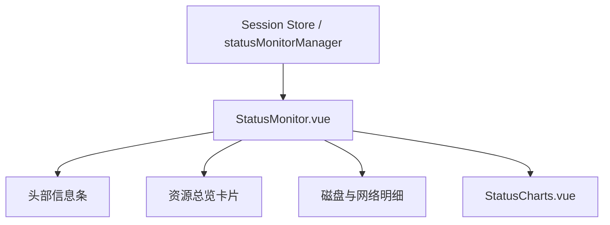

# 变更提案: status-monitor-responsive-remodel

## 元信息
```yaml
类型: 重构/优化
方案类型: implementation
优先级: P1
状态: 已确认
创建: 2026-04-15
```

---

## 1. 需求

### 背景
当前 `StatusMonitor.vue` 已经具备基础监控能力，但信息组织仍然偏表单式和松散卡片式，与用户给出的高密度监控参考图不一致。用户要求将“服务器状态”改造成统一的深色监控面板风格，同时明确指出不能直接照搬截图，因为现有组件结构、子组件边界和可用数据字段都与截图不同。

### 目标
- 在不改动后端数据结构的前提下，将 `StatusMonitor.vue` 重组为更接近参考图的高密度状态监控布局
- 同步调整 `StatusCharts.vue`，使底部趋势图与主监控区风格统一，避免视觉断层
- 保持侧栏窄宽度、常规工作区宽度和移动端下都能稳定展示，保证响应式体验

### 约束条件
```yaml
时间约束: 当前回合内完成设计、实现与验证
性能约束: 保持现有实时刷新逻辑，不引入额外轮询或高频动画负担
兼容性约束: 不修改 ServerStatus 数据模型，不破坏现有会话切换、历史趋势和复制 IP 等行为
业务约束: 仅使用现有 CPU/内存/Swap/网络/磁盘字段做“视觉映射”，不伪造参考图中不存在的数据组件
```

### 验收标准
- [ ] `StatusMonitor.vue` 输出统一的深色监控面板视觉，系统信息、CPU、内存、网络、磁盘分区清晰且整体节奏接近参考图
- [ ] `StatusCharts.vue` 与主监控区采用同一风格语言，图表容器、标题、边框、配色统一
- [ ] 在窄侧栏和宽容器下布局都可读，关键模块不会溢出或只在单一宽度下可用

---

## 2. 方案

### 技术方案
保留当前 `ServerStatus` 数据模型和 `StatusCharts` 的历史数据来源，仅重构前端展示层。

具体做法：
- 重写 `StatusMonitor.vue` 模板结构，将零散状态行重排为“头部信息条 + 资源总览区 + 分块卡片 + 趋势区”的紧凑监控布局
- 复用现有计算属性与格式化逻辑，并补充少量只读映射计算，使 CPU/Swap、内存统计、网络吞吐、磁盘信息可以更贴近参考图表达
- 改造 `StatusCharts.vue` 的图表外壳与配色，使其与主卡片共享同一套面板语言和暗色调
- 通过容器断点与媒体断点双层控制，针对侧栏窄宽度优先纵向堆叠，宽屏再切为多列布局

### 影响范围
```yaml
涉及模块:
  - packages/frontend/src/components/StatusMonitor.vue: 主监控面板结构与样式重构
  - packages/frontend/src/components/StatusCharts.vue: 趋势图外壳与主题风格统一
  - .helloagents/CHANGELOG.md: 记录本次实现型变更
预计变更文件: 3
```

### 风险评估
| 风险 | 等级 | 应对 |
|------|------|------|
| 参考图与现有组件结构不一致，易出现“强行复刻”后语义不通 | 中 | 按现有字段重组视觉模块，只在展示层做映射，不硬拼不存在的数据块 |
| 侧栏宽度较窄，复杂卡片容易挤压变形 | 中 | 使用 container query + media query 双层适配，优先保证窄宽度可读性 |
| 图表风格与主区域脱节 | 低 | 同步调整 `StatusCharts.vue` 的面板壳层、标题层级和配色体系 |

---

## 3. 技术设计（可选）

> 本次无后端接口和数据模型变更，仅描述前端组件关系调整。

### 架构设计


### API设计
N/A

### 数据模型
N/A

---

## 4. 核心场景

> 执行完成后同步到对应模块文档

### 场景: 窄侧栏中的服务器状态监控
**模块**: `packages/frontend/src/components/StatusMonitor.vue`
**条件**: 用户已连接活动会话，状态监控面板显示在侧栏或窄容器中
**行为**: 组件将系统信息、资源指标、磁盘和网络信息压缩为高密度纵向监控布局，并将趋势图保持为统一风格的可读模块
**结果**: 用户在窄宽度下也能快速看到核心监控信息，界面风格与参考图接近且保持结构自洽

---

## 5. 技术决策

> 本方案涉及的技术决策，归档后成为决策的唯一完整记录

### status-monitor-responsive-remodel#D001: 基于现有组件数据结构做视觉重构，而非截图式逐像素复刻
**日期**: 2026-04-15
**状态**: ✅采纳
**背景**: 用户给出的参考图和仓库内现有状态监控组件并不是同一套数据组织方式。若按截图硬做，会引入伪数据展示和组件结构错位。
**选项分析**:
| 选项 | 优点 | 缺点 |
|------|------|------|
| A: 直接按截图复刻 | 视觉最接近参考图 | 容易出现字段不匹配、组件语义错位、维护成本高 |
| B: 基于现有字段和组件边界做同风格重构 | 结构真实、可维护、能保留现有行为 | 与截图不会 1:1 完全一致 |
**决策**: 选择方案 B
**理由**: 用户已经明确提醒要注意组件情况，因此应优先尊重现有组件结构和真实数据边界，在此基础上做到风格、密度和节奏接近参考图。
**影响**: 影响 `StatusMonitor.vue` 与 `StatusCharts.vue` 的结构组织、样式语言和响应式策略

---

## 6. 成果设计

> 含视觉产出的任务由 DESIGN Phase2 填充。非视觉任务整节标注"N/A"。

### 设计方向
- **美学基调**: 工业监控台风格的深色数据面板，强调高密度、低装饰噪音、荧光状态色和类似运维控制面板的秩序感
- **记忆点**: 头部信息条与纵向资源块形成“窄屏也像真实服务器监控小屏”的强监控感
- **参考**: 用户提供的服务器状态截图；但实现以当前组件结构和真实字段为准

### 视觉要素
- **配色**: 以接近 `#14181d` 的炭黑背景为基底，辅以薄荷绿状态线、青蓝 CPU/网络高亮、琥珀磁盘标签和红色告警环形占比
- **字体**: 延续项目现有字体体系，不额外引入远程字体；通过更紧凑的字号层级、等宽数字和大写微标签来形成监控台气质
- **布局**: 顶部系统信息先行，资源块以纵向密集分段排列；在更宽容器中让次级统计变为网格，窄容器中退化为单列
- **动效**: 保留进度和图表的实时变化动势，避免夸张过渡；重点使用轻量 hover 和状态高亮
- **氛围**: 使用深色渐变、细边框、内阴影、弱发光线条和压低透明度的分隔来塑造监控终端氛围

### 技术约束
- **可访问性**: 保持文本和背景对比度；保留语义化标题与可点击 IP 的交互反馈
- **响应式**: 同时使用 container query 与 `@media` 断点；窄容器单列堆叠，较宽容器切回分栏
