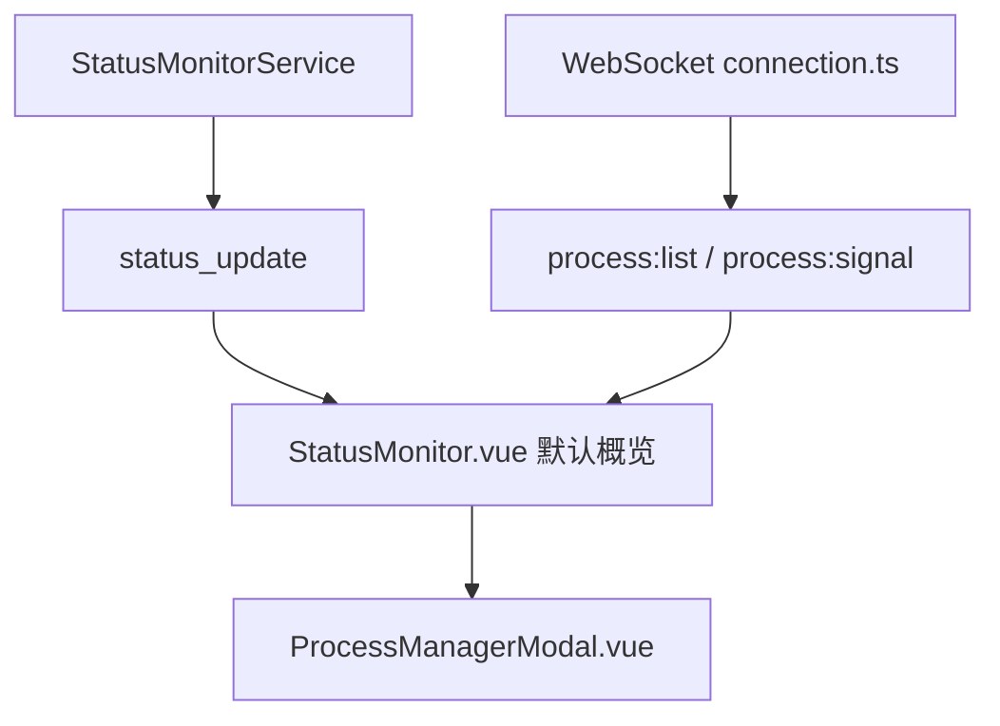

# 变更提案: status-monitor-process-manager-modal

## 元信息
```yaml
类型: 新功能/重构/优化
方案类型: implementation
优先级: P1
状态: 已确认
创建: 2026-04-15
```

---

## 1. 需求

### 背景
上一轮状态监控已经完成基础视觉重构，但用户明确反馈“不够好看，要更贴近参考图”，同时新增了明确需求：默认状态视图中需要补上时区、运行时间和进程管理概览；点击“查看全部”后，应弹出一个更完整的独立进程管理页面，风格接近用户提供的深色表格化管理截图。

### 目标
- 将默认状态视图继续收紧为更接近“服务器监控小屏”的布局节奏与视觉密度
- 在默认状态视图中新增时区、运行时间和进程管理概览
- 提供“查看全部”入口，打开独立 modal 形式的进程管理页面，支持搜索、刷新、自动刷新和结束/强制结束进程

### 约束条件
```yaml
时间约束: 当前回合内完成设计、实现、验证和知识库同步
性能约束: 进程列表查询与自动刷新不能影响现有 SSH 会话稳定性；默认视图仅展示摘要，避免持续渲染超长列表
兼容性约束: 复用现有 SSH 会话 WebSocket 链路，不破坏状态轮询、终端、Docker 和现有 modal 行为
业务约束: 默认视图是轻量概览；完整进程管理通过“查看全部” modal 打开，不直接把整张管理表挤进侧栏
```

### 验收标准
- [ ] `StatusMonitor.vue` 默认视图补齐时区、运行时间和进程概览，并整体更贴近用户给出的服务器小屏参考图
- [ ] 新增独立进程管理 modal，支持搜索、刷新、自动刷新、结束进程、强制结束进程
- [ ] 后端通过现有 WebSocket 会话返回时区、运行时间、进程列表和进程操作结果，前端构建通过

---

## 2. 方案

### 技术方案
本次改动分为三层：

1. 扩展状态监控后端采集：
- 在 `status-monitor.service.ts` 中新增服务器时区和运行时间采集
- 保持 `status_update` 主链路用于基础状态字段

2. 新增进程管理 WebSocket 能力：
- 在现有 SSH 会话 WebSocket 连接上扩展 `process:list` 与 `process:signal` 消息类型
- 后端通过当前活动 SSH 会话执行 `ps` 和 `kill` 指令，返回结构化进程列表与操作结果

3. 前端双层展示：
- `StatusMonitor.vue` 默认视图继续向监控小屏靠拢，新增时区、运行时间和进程概览卡片
- “查看全部” 打开新的 `ProcessManagerModal.vue`，其中嵌入完整进程管理表格视图
- 表格风格尽量贴近用户截图，采用紧凑列、搜索栏、自动刷新开关和右侧操作列

### 影响范围
```yaml
涉及模块:
  - packages/backend/src/services/status-monitor.service.ts: 扩展时区和运行时间采集
  - packages/backend/src/websocket/connection.ts: 新增进程查询与信号操作消息分发
  - packages/backend/src/websocket/types.ts: 扩展进程管理消息类型
  - packages/frontend/src/types/server.types.ts: 增加时区/运行时间字段
  - packages/frontend/src/components/StatusMonitor.vue: 默认状态视图继续贴近参考图并增加进程概览
  - packages/frontend/src/components/ProcessManagerModal.vue: 独立进程管理 modal
  - packages/frontend/src/locales/*.json: 新增进程管理与状态监控文案
  - .helloagents/modules/frontend.md / modules/backend.md / CHANGELOG.md: 同步知识库
预计变更文件: 8-10
```

### 风险评估
| 风险 | 等级 | 应对 |
|------|------|------|
| `ps` 输出格式在不同 Linux 发行版上存在差异 | 中 | 使用明确字段顺序与受控 awk/tab 分隔格式，后端集中解析并做回退 |
| 进程操作误伤系统进程 | 中 | 默认仅提供单行显式操作按钮，不做批量；强制结束作为二级危险动作高亮展示 |
| modal 自动刷新与会话切换叠加导致订阅混乱 | 中 | 前端对 active session / isVisible 建立显式注册与清理逻辑，关闭 modal 时停止自动刷新 |

---

## 3. 技术设计（可选）

> 本次以现有 SSH 会话 WebSocket 为主，不新增独立 HTTP 管理接口。

### 架构设计


### API设计
#### WebSocket `process:list`
- **请求**: `{ type: 'process:list', sessionId, payload: { limit?: number } }`
- **响应**: `{ type: 'process:list:response', sessionId, payload: { processes, total, running, sleeping } }`

#### WebSocket `process:signal`
- **请求**: `{ type: 'process:signal', sessionId, payload: { pid, signal: 'TERM' | 'KILL' } }`
- **响应**: `{ type: 'process:signal:response', sessionId, payload: { pid, signal, success, error? } }`

### 数据模型
| 字段 | 类型 | 说明 |
|------|------|------|
| `timezone` | `string` | 服务器当前时区显示文本 |
| `uptimeSeconds` | `number` | 服务器已运行秒数 |
| `ProcessListItem.pid` | `number` | 进程 ID |
| `ProcessListItem.user` | `string` | 所属用户 |
| `ProcessListItem.state` | `string` | 进程状态 |
| `ProcessListItem.cpu` | `number` | CPU 占比 |
| `ProcessListItem.memMb` | `number` | 内存占用，MB |
| `ProcessListItem.startedAt` | `string` | 启动时间文本 |
| `ProcessListItem.command` | `string` | 完整命令 |

---

## 4. 核心场景

### 场景: 默认状态视图查看进程概览
**模块**: `packages/frontend/src/components/StatusMonitor.vue`
**条件**: 用户已有活动 SSH 会话，状态监控面板正常显示
**行为**: 面板以更接近服务器监控小屏的密度展示系统、时区、运行时间和资源状态，并在底部显示进程概览和“查看全部”入口
**结果**: 用户无需离开侧栏即可快速判断机器运行情况，并知道是否需要打开完整进程管理

### 场景: 查看全部进程管理
**模块**: `packages/frontend/src/components/ProcessManagerModal.vue`
**条件**: 用户点击状态监控中的“查看全部”
**行为**: 打开独立 modal，显示可搜索的进程表格，并支持刷新、自动刷新、结束进程和强制结束
**结果**: 用户获得接近参考图的独立进程管理页面，同时仍保留在当前工作区上下文中

---

## 5. 技术决策

### status-monitor-process-manager-modal#D001: 进程管理沿当前 SSH 会话 WebSocket 链路实现
**日期**: 2026-04-15
**状态**: ✅采纳
**背景**: 进程列表和进程操作都依赖当前活动 SSH 会话上下文，若改走独立 HTTP 接口，需要额外解决会话绑定和 SSH 复用问题。
**选项分析**:
| 选项 | 优点 | 缺点 |
|------|------|------|
| A: 新增 HTTP 接口直连后台查询进程 | 前端调用方式统一 | 很难绑定当前 SSH 会话，需额外管理远端执行上下文 |
| B: 复用现有 SSH 会话 WebSocket 消息 | 与当前终端/状态监控链路一致，复用现有 sessionId 和 wsManager | 需要扩展消息类型和前端订阅 |
**决策**: 选择方案 B
**理由**: 与现有架构最一致，能自然绑定活动 SSH 会话，也更适合 modal 内的即时刷新和进程操作回执。
**影响**: 影响 `packages/backend/src/websocket/*`、`StatusMonitor.vue` 以及新的进程管理 modal 组件

---

## 6. 成果设计

### 设计方向
- **美学基调**: 更贴近运维监控终端的小屏控制台风格，默认视图强调紧凑、层级分明、状态色克制，弹窗则偏运维后台表格台面
- **记忆点**: 默认视图像“服务器小屏仪表”，而点击“查看全部”后立刻切到一张近似真实进程控制台的深色表格
- **参考**: 用户给出的服务器状态小屏截图 + 进程管理独立弹窗截图

### 视觉要素
- **配色**: 延续炭黑监控底色，默认视图用绿色/蓝色/琥珀色状态高亮；进程表格中的危险操作使用明显红色
- **字体**: 继续使用项目现有字体体系，强调等宽数字和紧凑列头，避免引入额外字体依赖
- **布局**: 默认视图尽量纵向、像小屏；进程管理 modal 采用顶栏搜索 + 表格主体 + 右侧操作列的后台结构
- **动效**: 仅保留轻量 hover、刷新和 modal 开合过渡，不增加大幅动画
- **氛围**: 深色渐变、薄边框、表格网格线、低饱和荧光状态色和危险动作红色高亮

### 技术约束
- **可访问性**: 表头、搜索框、按钮和危险操作需要明确可见状态；危险动作文字不能只靠颜色表达
- **响应式**: 默认视图继续兼容窄侧栏；modal 在桌面优先按参考图宽表格布局，小屏允许横向滚动
