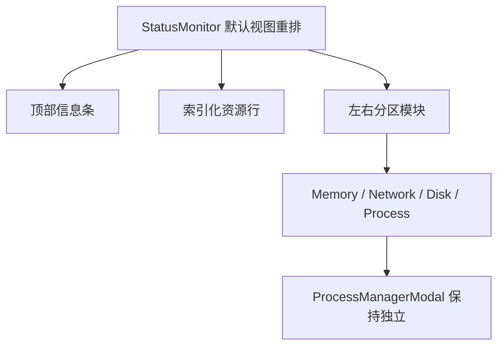

# 变更提案: status-monitor-reference-layout-parity

## 元信息
```yaml
类型: 重构/优化
方案类型: implementation
优先级: P1
状态: 已确认
创建: 2026-04-15
```

---

## 1. 需求

### 背景
上一轮已经为右侧状态监控补上时区、运行时间、进程概览和“查看全部”独立进程管理页，但用户继续明确指出默认视图的问题不是功能不够，而是布局骨架不对: 当前仍是通用卡片栅格，和参考图里那种窄屏监控面板的左右分区、信息压缩感、模块层级关系不一致。

### 目标
- 将 `StatusMonitor.vue` 默认视图重排为更接近参考图的紧凑监控面板结构
- 把顶部信息区改成成对的左右信息条，而不是松散的卡片网格
- 将 CPU / 内存 / 网络 / 磁盘 / 进程概览改为明显的左右内部分区，同时保持响应式
- 保留现有“查看全部”流程和后端数据边界，不为了贴图伪造不存在的数据字段

### 约束条件
```yaml
时间约束: 本轮内完成布局重排、构建验证和知识库同步
性能约束: 不新增重型图表依赖，不破坏现有状态监控刷新链路
兼容性约束: 保留 `StatusCharts`、`ProcessManagerModal`、现有 WebSocket 状态数据与设置项行为
业务约束: 默认视图只做概览；完整进程管理继续通过“查看全部”弹窗进入
```

### 验收标准
- [ ] `StatusMonitor.vue` 默认视图从通用卡片栅格重排为更接近参考图的窄屏监控布局，并体现明确的左右内部分区
- [ ] 顶部信息区、资源使用区、内存/网络/磁盘/进程概览都保持统一视觉风格，并兼容窄侧栏宽度
- [ ] 不新增虚构数据字段，继续复用当前后端已提供的状态数据
- [ ] `packages/frontend` 构建通过

---

## 2. 方案

### 技术方案
本次只改前端默认视图，不改后端协议:
- 在 `StatusMonitor.vue` 中移除原有“头部 + 元信息卡片网格 + 资源条带 + 多张通用卡片”的骨架
- 改为“头部身份区 + 成对信息条 + 索引化资源行 + 左右分区模块”的新布局
- CPU 区使用带编号的紧凑资源行表达 CPU / 内存 / Swap / 磁盘占比
- 内存区保留环形占比，但右侧改成紧凑统计堆叠
- 网络区改为左侧监控屏风格示意面板、右侧上下行速率堆叠卡
- 磁盘区改为左侧设备视觉块、右侧紧凑统计，再加底部摘要网格
- 进程区继续保留“查看全部”按钮，但默认只展示摘要和前几条高占用进程预览

### 影响范围
```yaml
涉及模块:
  - packages/frontend/src/components/StatusMonitor.vue: 默认视图模板与样式重构
  - .helloagents/modules/frontend.md: 同步默认视图与独立进程管理页的最新交付形态
  - .helloagents/CHANGELOG.md: 记录本轮状态监控默认视图重排
  - .helloagents/archive/_index.md: 归档索引补录
预计变更文件: 4
```

### 风险评估
| 风险 | 等级 | 应对 |
|------|------|------|
| 右侧窄栏下信息再次堆叠或换行失控 | 中 | 使用 container query 收紧断点，优先保证左右关系，再在极窄宽度下退化为单列 |
| 过度贴近参考图导致引入伪历史图表 | 中 | 只用当前已有实时字段做布局表达，不引入伪造时间序列数据 |
| 视觉语言与现有进程管理弹窗脱节 | 低 | 统一深色监控基调、边框层级和数字显示风格 |

---

## 3. 技术设计（可选）

> 涉及架构变更、API设计、数据模型变更时填写

### 架构设计


### API设计
N/A，本轮不新增接口。

### 数据模型
| 字段 | 类型 | 说明 |
|------|------|------|
| `cpuPercent` / `memPercent` / `swapPercent` / `diskPercent` | `number` | 继续驱动默认视图资源行与占比展示 |
| `timezone` / `uptimeSeconds` | `string` / `number` | 顶部概览信息条 |
| `netRxRate` / `netTxRate` / `netRxTotalBytes` / `netTxTotalBytes` | `number` | 网络模块左右区块展示 |
| `topProcesses` / `processTotal` / `processRunning` / `processSleeping` | `array` / `number` | 进程概览与“查看全部”入口前的默认预览 |

---

## 4. 核心场景

> 执行完成后同步到对应模块文档

### 场景: 默认状态监控更贴近参考图
**模块**: `packages/frontend/src/components/StatusMonitor.vue`
**条件**: 用户在 `/workspace` 右侧状态监控面板查看在线服务器状态
**行为**: 默认视图以更紧凑的监控小屏结构展示顶部信息条、索引化资源行、左右分区的内存/网络/磁盘模块，以及保留“查看全部”的进程概览
**结果**: 用户在不打开独立管理页时，也能得到更接近参考图层级和左右关系的默认状态视图

---

## 5. 技术决策

> 本方案涉及的技术决策，归档后成为决策的唯一完整记录

### status-monitor-reference-layout-parity#D001: 默认视图采用“结构重排”而不是继续叠加装饰样式
**日期**: 2026-04-15
**状态**: ✅采纳
**背景**: 用户已多次明确指出问题在于默认视图的左右布局和内部模块关系，而不是颜色、阴影或单个组件细节不够“好看”。
**选项分析**:
| 选项 | 优点 | 缺点 |
|------|------|------|
| A: 继续在现有卡片栅格上加样式 | 改动小、风险低 | 结构仍不对，无法解决用户指出的左右关系问题 |
| B: 直接重排默认视图骨架 | 能从布局层接近参考图，问题命中更准确 | 需要同时改模板与样式，改动面更大 |
**决策**: 选择方案 B
**理由**: 当前差距来自信息组织方式，而不是视觉细节。只有重排结构，才能把默认视图从“通用 dashboard 卡片”拉回“服务器小屏监控”。
**影响**: 影响 `StatusMonitor.vue` 模板层级、样式系统以及知识库中的状态监控描述

---

## 6. 成果设计

> 含视觉产出的任务由 DESIGN Phase2 填充。非视觉任务整节标注"N/A"。

### 设计方向
- **美学基调**: 深色运维监控台，小屏幕密度、冷光监控线条、紧凑数字化排版
- **记忆点**: 不是一组普通卡片，而是每块内容都带明显左右分区和监控屏幕感
- **参考**: 用户提供的服务器状态小屏截图，重点参考其左右布局关系与窄屏密度

### 视觉要素
- **配色**: 以近黑蓝灰为底，绿/蓝/黄/红分别标识资源状态，避免花哨渐变堆叠
- **字体**: 延续项目现有字体体系，关键数字采用 monospace，强调监控台读数感
- **布局**: 默认单列主轴，模块内部优先左右分区；宽度足够时局部双列，但不回退为松散卡片网格
- **动效**: 仅保留 hover 和按钮轻微上浮反馈，不新增喧宾夺主的入场动画
- **氛围**: 深色控制台底、轻微玻璃层、细边框、低饱和荧光强调和屏幕网格细节

### 技术约束
- **可访问性**: 保留文本标签，不以纯颜色表达状态；按钮和信息块保持明确 hover / click 反馈
- **响应式**: 依赖 container query 保持右侧侧栏适配，在极窄宽度下逐步退化而不破坏信息可读性
