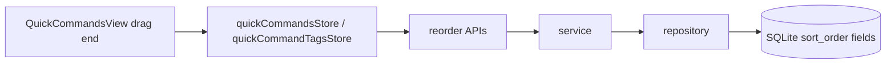

# 变更提案: quickcommands-drag-reorder

## 元信息
```yaml
类型: 新功能
方案类型: implementation
优先级: P1
状态: 已完成
创建: 2026-04-19
完成: 2026-04-19
```

---

## 1. 需求

### 背景
当前快捷指令视图已经支持按标签分组、按名称或最近使用时间浏览命令，并提供双击执行、右键菜单、动态变量与标签编辑等能力，但分组顺序仍然按标签名派生，组内命令顺序也只能依赖计算排序，用户无法把高频分组和常用命令固定在自己习惯的位置。随着工作台内快捷指令数量增加，这会降低定位效率，也和连接树等区域正在逐步支持拖拽重排的交互方向不一致。

### 目标
- 让快捷指令分组支持拖动排序，并在刷新后保持自定义顺序。
- 让快捷指令支持在分组内拖动排序，并在刷新后保持自定义顺序。
- 让关闭标签分组后的扁平列表同样支持拖动排序。
- 在一条命令可绑定多个标签的前提下，明确全局顺序和标签内顺序的持久化语义。

### 约束条件
```yaml
时间约束: 本轮完成前后端联动实现与基础构建验证
性能约束: 不新增依赖，复用仓库已有的 vuedraggable
兼容性约束: 需要兼容现有 SQLite 数据库，通过 migration 为历史数据补齐顺序字段
业务约束: 搜索过滤结果不参与拖拽重排，避免只对局部可见子集排序造成顺序污染
```

### 验收标准
- [ ] 开启标签分组时，已标记分组支持拖动排序，刷新页面后顺序保持不变。
- [ ] 开启标签分组时，组内命令支持拖动排序，刷新页面后顺序保持不变。
- [ ] 关闭标签分组时，扁平命令列表支持拖动排序，刷新页面后顺序保持不变。
- [ ] 多标签命令在不同标签组内可拥有各自的组内顺序，不因编辑命令或补标签而丢失既有顺序。
- [ ] `packages/backend` 与 `packages/frontend` 的构建验证通过。

---

## 2. 方案

### 技术方案
本次改动分三层落地。

第一层是数据层，为 `quick_commands`、`quick_command_tags` 与 `quick_command_tag_associations` 三张表分别新增 `sort_order` 字段，并通过 migration 为历史数据回填稳定初始顺序。命令表顺序用于扁平列表与“未标记”分组，标签表顺序用于分组顺序，关联表顺序用于“命令在某个标签组中的局部位置”。

第二层是接口层，在现有快捷指令与快捷指令标签业务域中新增三个重排接口: 标签重排、全局命令重排、标签内命令重排。同时改造现有标签关联写入逻辑，避免编辑命令时通过“先删后插”破坏已有组内顺序。

第三层是前端交互层，在 `QuickCommandsView.vue` 中接入拖拽句柄和持久化回写逻辑，并把命令排序模式扩展为 `manual`、`name`、`last_used`。用户完成拖拽后自动切回 `manual` 模式，确保拖拽结果可以立即可见且稳定保留。

### 影响范围
```yaml
涉及模块:
  - backend: quick-commands / quick-command-tags / database migration 需要新增顺序字段与重排接口
  - frontend: quickCommands.store / quickCommandTags.store / QuickCommandsView 需要支持手动顺序与拖拽持久化
  - knowledge-base: 需要同步 frontend/backend 模块文档与 CHANGELOG
预计变更文件: 10-14
```

### 风险评估
| 风险 | 等级 | 应对 |
|------|------|------|
| 多标签命令在多个分组中复用，若仍把组内顺序放在命令表会产生语义冲突 | 高 | 将“标签内顺序”存储到关联表，命令表只承载全局顺序 |
| 历史数据库没有顺序字段，直接读取会导致老数据顺序混乱 | 中 | 通过 migration 补字段并按现有主键或 rowid 回填初始顺序 |
| 搜索过滤结果下拖拽会导致只重排局部子集，用户感知混乱 | 中 | 搜索态禁用拖拽，只允许在完整列表状态下重排 |
| 编辑命令标签时若继续删除并重建关联，会丢失既有组内顺序 | 中 | 改为增量同步标签关联，保留未移除标签的原顺序 |

---

## 3. 技术设计

### 架构设计


### API设计
#### PUT /api/v1/quick-command-tags/reorder
- **请求**:
```json
{
  "tagIds": [3, 1, 5]
}
```
- **响应**:
```json
{
  "message": "快捷指令标签顺序已更新"
}
```

#### PUT /api/v1/quick-commands/reorder
- **请求**:
```json
{
  "commandIds": [11, 7, 9, 2]
}
```
- **响应**:
```json
{
  "message": "快捷指令顺序已更新"
}
```

#### PUT /api/v1/quick-commands/reorder-by-tag
- **请求**:
```json
{
  "tagId": 3,
  "commandIds": [7, 11, 9]
}
```
- **响应**:
```json
{
  "message": "标签内快捷指令顺序已更新"
}
```

### 数据模型
| 字段 | 类型 | 说明 |
|------|------|------|
| `quick_commands.sort_order` | `INTEGER` | 快捷指令的全局手动顺序，供扁平视图与未标记分组使用 |
| `quick_command_tags.sort_order` | `INTEGER` | 快捷指令分组的手动顺序 |
| `quick_command_tag_associations.sort_order` | `INTEGER` | 某条命令在某个标签分组内的手动顺序 |
| `QuickCommandWithTags.tagOrders` | `Record<number, number>` | 返回给前端的“标签 ID -> 组内顺序”映射 |
| `QuickCommandSortByType` | `'manual' | 'name' | 'usage_count' | 'last_used'` | 前端命令列表排序模式 |

---

## 4. 核心场景

### 场景: 调整分组顺序
**模块**: frontend / backend
**条件**: 用户开启快捷指令标签展示，且当前不处于搜索过滤状态。
**行为**: 用户拖动某个已标记分组的标题句柄，前端更新本地拖拽列表并调用标签重排接口。
**结果**: 分组按用户定义的顺序显示，刷新后保持一致，“未标记”分组继续固定在已标记分组之后。

### 场景: 调整标签组内命令顺序
**模块**: frontend / backend
**条件**: 用户在某个标签分组内拖动命令项，且当前不处于搜索过滤状态。
**行为**: 前端将该分组内的命令 ID 顺序提交到标签内重排接口，并自动切换到手动排序模式。
**结果**: 当前分组内的命令顺序立即更新，后续刷新后仍保持该顺序，不影响其它标签组的局部顺序。

### 场景: 调整扁平命令顺序
**模块**: frontend / backend
**条件**: 用户关闭“显示快捷指令标签”设置后浏览扁平列表。
**行为**: 用户拖动命令项，前端提交全局命令重排接口。
**结果**: 扁平列表与“未标记”分组的手动顺序保持一致，仍可切换回名称或最近使用排序查看其它视图。

---

## 5. 技术决策

### quickcommands-drag-reorder#D001: 将“标签内命令顺序”存储在关联表，而不是 quick_commands 主表
**日期**: 2026-04-19
**状态**: 已采纳
**背景**: 一条快捷指令可以绑定多个标签，因此同一条命令可能同时出现在多个分组中。如果组内顺序只存到 `quick_commands` 主表，就无法表达“同一条命令在 A 组和 B 组中的位置不同”。
**选项分析**:
| 选项 | 优点 | 缺点 |
|------|------|------|
| A: 仅在 `quick_commands` 存一个 `sort_order` | 结构简单，接口少 | 无法支持多标签命令在不同分组中的不同顺序 |
| B: 在 `quick_command_tag_associations` 存组内 `sort_order`，命令表保留全局 `sort_order` | 语义完整，能兼容分组视图与扁平视图 | 实现比单表排序稍复杂，需要额外重排接口 |
**决策**: 选择方案 B
**理由**: 这是唯一能同时满足“分组内可排序”和“命令可绑定多个标签”两项约束的方案，同时仍能通过命令表上的全局顺序支持扁平视图。
**影响**: backend, frontend

### quickcommands-drag-reorder#D002: 保留现有名称与最近使用排序，同时新增手动排序模式承接拖拽结果
**日期**: 2026-04-19
**状态**: 已采纳
**背景**: 现有快捷指令视图已经有按名称与最近使用查看命令的需求，直接移除会造成回归；但拖拽排序又必须有一个稳定的“手动顺序”视图承接。
**选项分析**:
| 选项 | 优点 | 缺点 |
|------|------|------|
| A: 用拖拽排序完全替代名称和最近使用排序 | 交互简单 | 会删除已有浏览方式，造成功能回退 |
| B: 增加 `manual` 模式，并在拖拽完成后自动切换到该模式 | 兼容现有浏览模式，同时让拖拽结果立即可见 | 排序状态管理略复杂 |
**决策**: 选择方案 B
**理由**: 能在不删除现有排序入口的前提下，为拖拽排序提供明确而可持久化的展示模式。
**影响**: frontend

---

## 6. 成果设计

### 设计方向
- **美学基调**: 延续现有工作台深色工具面板风格，在不改变整体布局语言的前提下，加入轻量的“可拖动”信号，让快捷指令列表更像可编排控制台而不是静态目录。
- **记忆点**: 分组标题和命令行都带有低干扰的拖拽句柄，拖动时保持现有卡片与高亮体系，仅在当前位置给出明确占位反馈。
- **参考**: 当前 `QuickCommandsView.vue` 的工作台卡片样式，以及连接树拖拽占位反馈的交互方向。

### 视觉要素
- **配色**: 继续复用现有主题变量与 hover/highlight 色，不新增独立色板，只让拖拽句柄在 hover 与拖拽时增强对比。
- **字体**: 沿用当前工作台文本和命令 monospace 字体体系，避免因交互增强引入新的字体层级。
- **布局**: 不改动现有控制栏、分组头和命令项的主体结构，仅在左侧插入窄句柄区域，并在拖拽态显示占位边框。
- **动效**: 复用 `vuedraggable` 的位移动画与现有过渡时间，保证拖放反馈清晰但不过度跳动。
- **氛围**: 保持克制、专业的终端工作台气质，把“可重排”表达为操作强化，而不是视觉重设计。

### 技术约束
- **可访问性**: 拖拽增强不能破坏现有单击选中、双击执行、键盘 `Enter` 执行与右键菜单入口。
- **响应式**: 继续兼容现有紧凑模式与工作台不同宽度场景，句柄区域不能挤占命令文本的主要可读空间。
