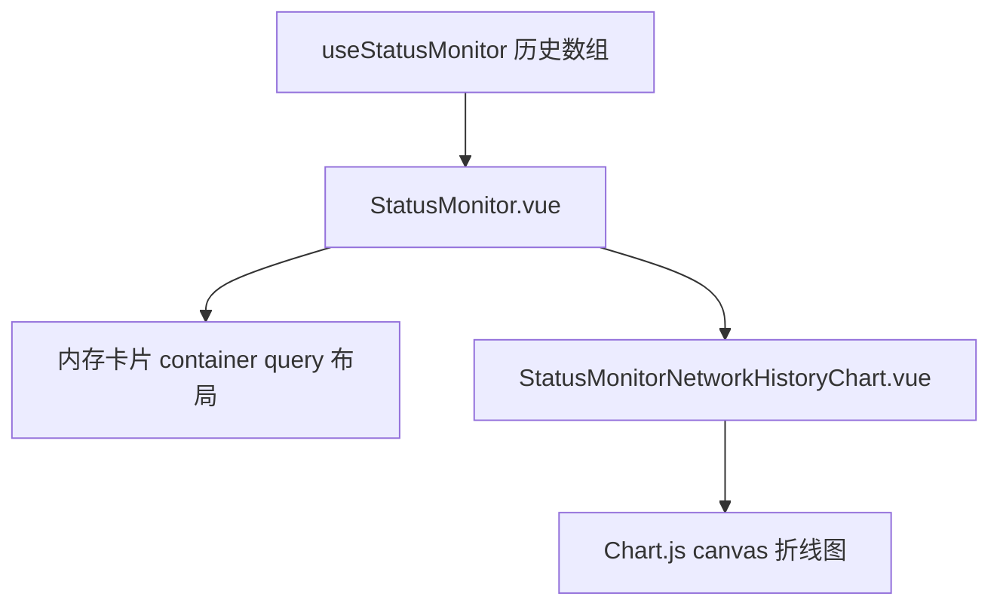

# 变更提案: status-monitor-memory-network-canvas-history

## 元信息
```yaml
类型: 优化
方案类型: implementation
优先级: P1
状态: 已确认
创建: 2026-04-19
```

---

## 1. 需求

### 背景
当前 `/workspace` 右侧状态监控面板里，内存模块在较宽但仍偏窄的侧栏下过早切成手机式竖排，导致信息密度下降；网络模块则继续沿用 SVG sparkline，只能看趋势轮廓，无法像底部 `StatusCharts.vue` 那样通过 `canvas` 折线图查看更明确的历史采样值。用户明确要求把内存和网络模块的竖排阈值都收紧到“组件宽度低于 250px 才切手机竖排”，并把网络线图升级成可查看历史数据的 `canvas` 图表。

### 目标
- 将内存卡片的响应式切换阈值收紧到容器宽度小于 `250px` 才改为竖排布局。
- 让网络卡片遵循同样的 `250px` 响应式阈值，并在宽度充足时保持更高信息密度的横向布局。
- 把网络卡片的 SVG 线改成 `canvas` 折线图，展示最近 24 个采样点，并支持 hover 查看上下行历史值。
- 复用现有历史采样数据链路，不新增后端接口或 websocket 消息。

### 约束条件
```yaml
时间约束: 本轮只改前端状态监控相关组件和文案
性能约束: 复用现有 Chart.js / vue-chartjs 依赖，不新增图表库
兼容性约束: 不改变 useStatusMonitor 现有历史数组结构和 StatusCharts 既有行为
业务约束: 历史图展示基于现有前端采样缓存，仅限当前会话已收到的监控数据
```

### 验收标准
- [ ] 内存模块在容器宽度大于等于 `250px` 时保持横向高密度布局，仅在低于 `250px` 时切为竖排。
- [ ] 网络模块遵循同样的 `250px` 阈值，并在宽度充足时展示图表与统计信息的横向布局。
- [ ] 网络模块的折线图使用 `canvas` 渲染，数据来自最近 24 个网络历史采样点。
- [ ] 鼠标 hover 网络图时可查看上下行历史值，单位与当前历史峰值一致。
- [ ] 前端构建通过；若缺少本地后端导致运行态无法全链路验证，需要在执行备注中如实记录。

---

## 2. 方案

### 技术方案
保留 `useStatusMonitor.ts` 的历史采样来源不变，在 `StatusMonitor.vue` 中重组内存和网络卡片布局。内存卡片改为默认双列分布，仅在模块容器宽度低于 `250px` 时切为单列。网络卡片新增一个专用的 `StatusMonitorNetworkHistoryChart.vue` 子组件，用 `vue-chartjs` + Chart.js 渲染最近 24 个采样点的上下行折线图，沿用 `StatusCharts.vue` 的单位换算思路与 hover tooltip 行为，并在 `250px` 以下退回为单列竖排。

### 影响范围
```yaml
涉及模块:
  - frontend: StatusMonitor 卡片布局与网络历史图展示
  - frontend-i18n: 状态监控卡片新增历史采样提示文案
预计变更文件: 6
```

### 风险评估
| 风险 | 等级 | 应对 |
|------|------|------|
| 在窄侧栏下新增 Chart.js 画布导致卡片高度或宽度挤压 | 中 | 将网络卡片拆成受 container query 控制的双列/单列布局，并限制图表包装高度 |
| 小图表与底部大图表重复渲染后造成会话切换时重绘抖动 | 中 | 仅渲染最近 24 点，关闭动画，使用轻量 options 并避免额外 watcher |
| 单位换算在小图与大图不一致，导致用户误读 | 低 | 直接复用与 `StatusCharts.vue` 一致的峰值判定和 tooltip 单位策略 |

---

## 3. 技术设计（可选）

### 架构设计


### 数据模型
| 字段 | 类型 | 说明 |
|------|------|------|
| `netRxHistory` | `(number | null)[]` | 当前会话的下载速率历史，单位为 Bytes/sec |
| `netTxHistory` | `(number | null)[]` | 当前会话的上传速率历史，单位为 Bytes/sec |
| `memUsedHistory` | `(number | null)[]` | 当前会话的已用内存历史，继续由底部图表使用 |

---

## 4. 核心场景

> 执行完成后同步到对应模块文档

### 场景: 侧栏宽度适中时保持高密度监控布局
**模块**: frontend
**条件**: 用户在 `/workspace` 右侧状态监控中查看内存和网络模块，模块宽度大于等于 `250px`。
**行为**: 内存卡片保持环形概览与统计块并排，网络卡片保持历史图与统计表并排。
**结果**: 用户在常见侧栏宽度下看到更高密度的监控信息，而不是过早进入手机竖排布局。

### 场景: 网络模块查看近期历史采样
**模块**: frontend
**条件**: 当前会话已积累网络历史采样，用户将鼠标移动到网络卡片中的折线图上。
**行为**: `canvas` 折线图显示最近 24 个采样点，并通过 tooltip 展示该采样点的上下行历史值。
**结果**: 用户可以在侧栏内直接查看近期网络波动，而不必只看 SVG 趋势线或切到下方大图。

---

## 5. 技术决策

> 本方案涉及的技术决策，归档后成为决策的唯一完整记录

### status-monitor-memory-network-canvas-history#D001: 复用 Chart.js 实现网络卡片内联历史图
**日期**: 2026-04-19
**状态**: ✅采纳
**背景**: 网络卡片需要从 SVG sparkline 升级为可 hover 查看历史值的 `canvas` 图表，但仓库已经存在底部 `StatusCharts.vue` 的 Chart.js 方案。
**选项分析**:
| 选项 | 优点 | 缺点 |
|------|------|------|
| A: 继续手写 SVG sparkline 并自建 hover 逻辑 | 依赖少、组件轻 | 需要自行处理命中区域、tooltip、单位换算和历史点映射 |
| B: 复用现有 Chart.js / vue-chartjs 体系做小型内联图 | `canvas` 输出天然满足需求，tooltip 和响应式能力现成 | 需要额外封装一个轻量子组件，避免主文件继续膨胀 |
**决策**: 选择方案 B
**理由**: 仓库已稳定使用 Chart.js，直接复用能最小成本满足“canvas + 历史值 hover”要求，同时与底部图表保持交互一致。
**影响**: 影响前端状态监控卡片结构与本地文案，不涉及后端接口和状态采样协议。

---

## 6. 成果设计

### 设计方向
- **美学基调**: 延续当前状态监控的深色服务器小屏风格，但把“趋势感”从装饰性线条升级为更有仪表感的真实历史图。
- **记忆点**: 网络卡片左侧嵌入式 `canvas` 折线图，在狭窄侧栏内也能像迷你监控屏一样浏览最近采样。
- **参考**: 视觉与交互参考现有 `StatusCharts.vue`，但收敛为卡片内联版本，维持当前状态监控卡片的材质和边框体系。

### 视觉要素
- **配色**: 保持深色背景和当前网络上下行的绿/蓝语义色，不引入新的主色体系。
- **字体**: 沿用现有状态监控与图表中的 monospace 数值展示。
- **布局**: 网络模块在宽度充足时采用“图表左 / 数据右”的双列结构，低于 `250px` 再退化为竖排。
- **动效**: 图表关闭动画，仅保留 hover tooltip 反馈，避免监控场景下的无意义运动。
- **氛围**: 保持服务器监控面板的控制台式深色氛围，不做额外装饰性改造。

### 技术约束
- **可访问性**: 图表容器保留可读标题和最近采样说明，避免只剩抽象线条。
- **响应式**: 以 container query 为准，`250px` 以下才切为手机竖排。
