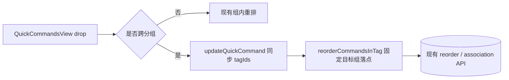

# 变更提案: quickcommands-cross-group-drag-move

## 元信息
```yaml
类型: 新功能
方案类型: implementation
优先级: P1
状态: 已完成
创建: 2026-04-19
完成: 2026-04-19
```

---

## 1. 需求

### 背景
快捷指令视图已经支持分组拖拽排序、组内命令拖拽排序和扁平列表拖拽排序，但当前命令拖放逻辑仍然把拖拽限制在“同一分组内”。这会导致用户虽然能整理每个分组内部的顺序，却不能把命令从一个标签组直接拖到另一个标签组，也不能把“未标记”命令直接拖进目标标签组，和 Workbench 中“拖到目标容器即完成归类”的直觉交互不一致。

### 目标
- 让已标记分组中的命令可以拖到另一个已标记分组内，并在落点位置插入。
- 让“未标记”分组中的命令可以直接拖到已标记分组内，并自动添加目标标签。
- 跨分组移动后移除原分组标签，只保留目标分组与其它未受影响的既有标签。
- 修正快捷指令排序按钮在 `manual / name / last_used` 三种模式下的文案和图标映射。

### 约束条件
```yaml
时间约束: 本轮完成前端实现、构建验证与知识库同步
性能约束: 不新增依赖，继续使用现有原生 drag/drop 与 store action
兼容性约束: 优先复用现有后端增量标签同步与重排接口，不新增后端路由
业务约束: 搜索过滤态仍禁止拖拽排序；本轮暂不支持把已标记命令拖入“未标记”分组
```

### 验收标准
- [ ] 开启标签分组时，把命令从标签 A 拖到标签 B 后，命令会移除标签 A、加入标签 B，并插入到标签 B 的目标位置。
- [ ] 开启标签分组时，把“未标记”命令拖到标签 B 后，命令会新增标签 B，并插入到标签 B 的目标位置。
- [ ] 当前轮次不支持把已标记命令拖入“未标记”分组，界面会给出非阻断提示而不是错误修改标签。
- [ ] 排序按钮能正确反映 `manual / name / last_used` 三种模式的标题与图标。
- [ ] `npm run build --workspace @nexus-terminal/backend` 与 `npm run build --workspace @nexus-terminal/frontend` 通过。

---

## 2. 方案

### 技术方案
本次改动只调整前端编排，继续复用已落地的快捷指令更新与顺序持久化能力，不新增后端接口。

第一步，在 `QuickCommandsView.vue` 放开命令拖放目标的“同组限制”，并补一个支持“源项不在目标列表中时插入”的列表工具函数。这样拖拽命中目标组后，既能处理原来的组内重排，也能处理跨组插入。

第二步，在命令 drop 分支中区分三类路径：同组重排继续沿用现有 `reorderCommandsInTag` / `reorderQuickCommands`；“未标记 -> 已标记”与“已标记 A -> 已标记 B”则先通过 `updateQuickCommand(...)` 更新标签集合，再按目标组当前列表调用 `reorderCommandsInTag(targetTagId, ...)` 固定落点顺序。

第三步，保留“拖到未标记分组”禁用策略。因为本轮已确认的业务语义是“移除原标签并加入目标标签”，而未标记分组没有可加入的标签，若开放该动作就会变成“删除标签”或“清空所有标签”，和当前确认范围冲突，所以只给用户提示，不执行实际写入。

最后顺手修正排序按钮在 `manual` 模式下的标题与图标，让拖拽完成后切回 `manual` 时，控件状态与实际排序一致。

### 影响范围
```yaml
涉及模块:
  - frontend: QuickCommandsView 需要实现跨分组拖放与 manual 排序按钮修正
  - knowledge-base: 需要同步 frontend/backend 模块文档与 CHANGELOG
预计变更文件: 5-7
```

### 风险评估
| 风险 | 等级 | 应对 |
|------|------|------|
| 跨组移动先改标签、再改目标组顺序，中间刷新可能导致落点顺序丢失 | 中 | 在标签更新完成后立刻基于刷新后的目标组列表再次提交 `reorderCommandsInTag` |
| 目标是“未标记”分组时语义不清，可能被误实现为清空全部标签 | 高 | 明确禁止该路径，仅提示用户本轮不支持 |
| 多标签命令跨组移动时若直接覆盖 tagIds，可能误删其他标签 | 中 | 基于原 `tagIds` 做“移除 sourceTagId、加入 targetTagId”的增量计算 |
| `manual` 排序按钮状态未修正，用户会误判当前排序模式 | 低 | 同步补齐 `sortButtonTitle` 和 `sortButtonIcon` 的三态映射 |

---

## 3. 技术设计

### 架构设计


### API设计
#### PUT /api/v1/quick-commands/:id
- **请求**:
```json
{
  "name": "Deploy",
  "command": "npm run deploy",
  "tagIds": [5, 9]
}
```
- **响应**:
```json
{
  "message": "快捷指令已更新"
}
```

#### PUT /api/v1/quick-commands/reorder-by-tag
- **请求**:
```json
{
  "tagId": 9,
  "commandIds": [12, 7, 19]
}
```
- **响应**:
```json
{
  "message": "标签内快捷指令顺序已更新"
}
```

### 数据模型
| 字段 | 类型 | 说明 |
|------|------|------|
| `QuickCommandFE.tagIds` | `number[]` | 命令当前绑定的标签集合，跨组移动时按“移除源标签 + 加入目标标签”增量计算 |
| `QuickCommandFE.tagOrders` | `Record<number, number>` | 命令在各标签组中的局部顺序，更新标签后通过目标组重排接口重新固定 |
| `GroupedQuickCommands.commands` | `QuickCommandFE[]` | 分组视图当前命令列表，跨组插入后用于计算目标顺序 |
| `QuickCommandSortByType` | `'manual' | 'name' | 'usage_count' | 'last_used'` | 排序按钮需要正确反映其中实际启用的三种前端模式 |

---

## 4. 核心场景

### 场景: 已标记命令拖到另一个已标记分组
**模块**: frontend
**条件**: 用户开启快捷指令标签分组，当前不处于搜索过滤状态。  
**行为**: 用户把标签 A 中的命令拖到标签 B 的某个命令上，前端先移除标签 A、加入标签 B，再按落点重排标签 B。  
**结果**: 命令从标签 A 消失，出现在标签 B 的目标位置，刷新后保持一致。

### 场景: 未标记命令拖到已标记分组
**模块**: frontend
**条件**: 用户开启快捷指令标签分组，存在“未标记”分组且当前不处于搜索过滤状态。  
**行为**: 用户把“未标记”命令拖到某个标签组内，前端为命令新增目标标签，并在目标组内固定插入顺序。  
**结果**: 命令离开“未标记”分组，进入目标标签组。

### 场景: 已标记命令拖到未标记分组
**模块**: frontend
**条件**: 用户尝试把某个标签组中的命令拖到“未标记”分组。  
**行为**: 前端识别为当前轮次未支持的路径，只给出提示，不提交更新请求。  
**结果**: 原有标签关系保持不变，避免误清空标签。

---

## 5. 技术决策

### quickcommands-cross-group-drag-move#D001: 优先复用现有更新与重排接口，而不是新增“跨组移动”专用后端接口
**日期**: 2026-04-19
**状态**: 已采纳
**背景**: 现有后端已经提供 `updateQuickCommand`、`reorder-by-tag` 和增量标签关联同步能力，理论上足以表达“移除原标签、加入目标标签、固定目标组顺序”。
**选项分析**:
| 选项 | 优点 | 缺点 |
|------|------|------|
| A: 新增后端 `move-between-tags` 专用接口 | 前端调用简单，语义集中 | 需要新增 controller/service/repository 路径，改动面更大 |
| B: 复用现有更新命令 + 标签内重排接口 | 后端零新增接口，改动集中在前端编排 | 前端需要串联两步请求 |
**决策**: 选择方案 B
**理由**: 当前用户确认的是交互增强，不是后端能力缺失。复用现有接口可以最小代价完成需求，并降低本轮回归面。
**影响**: frontend

### quickcommands-cross-group-drag-move#D002: 本轮禁止“已标记 -> 未标记”拖放
**日期**: 2026-04-19
**状态**: 已采纳
**背景**: 已确认的业务语义是“拖到目标分组后，移除原分组标签并加入目标分组标签”。未标记分组没有可加入的标签，因此该路径语义不完整。
**选项分析**:
| 选项 | 优点 | 缺点 |
|------|------|------|
| A: 拖入未标记时清空全部标签 | 交互看起来完整 | 会把“移动分组”变成“清空标签”，风险高且和当前确认不一致 |
| B: 拖入未标记时只移除源标签 | 语义比清空全部标签更保守 | 对多标签命令仍不清晰，用户难以预期 |
| C: 本轮禁用该路径，只提示用户 | 范围清晰，不引入隐式删除语义 | 功能覆盖面少一步 |
**决策**: 选择方案 C
**理由**: 当前需求边界已经确认到“加入目标标签”，而未标记不具备该条件。禁用比猜测性实现更安全。
**影响**: frontend

---

## 6. 成果设计

### 设计方向
- **美学基调**: 延续现有快捷指令工作台的深色工具面板风格，不做视觉重设计，只强化“卡片可以被移入另一组”的操作感。
- **记忆点**: 命令卡片在跨组拖放时仍使用现有虚线高亮占位，用户可以直接感知落点是在目标组内部而不是只做选中。
- **参考**: 复用当前 `QuickCommandsView.vue` 中已存在的组内拖拽高亮和手动排序交互。

### 视觉要素
- **配色**: 继续沿用主题变量和当前 `qc-drop-target` 虚线反馈，不新增独立拖拽色板。
- **字体**: 沿用现有标题和命令 monospace 体系，不调整文本层级。
- **布局**: 保持现有分组头和命令卡结构，仅扩展拖放命中逻辑与排序按钮状态表达。
- **动效**: 继续使用现有 hover / 拖放过渡，不增加额外动画。
- **氛围**: 保持克制、偏工程控制台的交互表达，让跨组归类像“拖入目标容器”一样直接。

### 技术约束
- **可访问性**: 不能破坏现有单击选中、双击执行、右键菜单和键盘选择逻辑。
- **响应式**: 继续兼容紧凑模式与 Workbench 窄栏布局，不增加额外结构占位。
