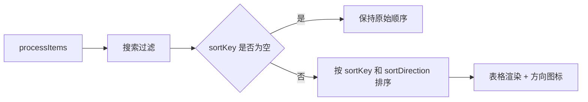

# 变更提案: process-manager-table-sort-and-close-spacing

## 元信息
```yaml
类型: 优化
方案类型: implementation
优先级: P1
状态: 已完成
创建: 2026-04-19
完成: 2026-04-19
```

---

## 1. 需求

### 背景
当前 `ProcessManagerModal.vue` 已经能展示服务器进程明细、支持搜索和手动刷新，但明细表仍然是纯静态表头。用户进入进程管理详细视图后，无法按 `PID`、`CPU`、`MEM` 等列快速切换视角来定位高占用进程或按进程号排查问题。同时，右上角绝对定位的关闭按钮与顶部刷新控制区距离过近，在当前布局下容易产生视觉拥挤，影响操作清晰度。

### 目标
- 允许点击进程管理表格头，按主要数据列切换排序显示。
- 为当前激活的排序列显示明确的升序/降序方向标记。
- 保持默认列表顺序与现有后端返回顺序一致，避免未点击表头前的展示语义回归。
- 拉开关闭按钮与刷新区的安全间距，避免顶部工具区拥挤。

### 约束条件
```yaml
时间约束: 本轮完成前端实现、构建验证与知识库同步
性能约束: 不新增依赖，继续使用现有 Vue 计算属性完成前端本地排序
兼容性约束: 不修改后端 process:list 消息结构，不改变默认未排序态
业务约束: 所有主要数据列都支持排序，但操作列保持不可排序
```

### 验收标准
- [ ] 进程管理表头至少支持 `PID / USER / STATE / CPU / MEM / START / COMMAND` 点击排序。
- [ ] 点击同一列表头时可以在升序和降序之间切换，并显示方向标记。
- [ ] 数值列首次点击默认按更符合排障习惯的方向排序，文本列首次点击默认按字母升序排序。
- [ ] 默认未点击表头时，进程列表仍保持现有后端返回顺序。
- [ ] 关闭按钮与刷新区之间有明确安全间距，不再显得贴近或覆盖。
- [ ] `npm run build --workspace @nexus-terminal/frontend` 通过。

---

## 2. 方案

### 技术方案
本次改动只落在前端 `ProcessManagerModal.vue`。

第一部分是表格排序。新增本地排序状态 `sortKey + sortDirection`，基于当前 `processItems` 先执行搜索过滤，再在计算属性中按所选列进行稳定排序。默认 `sortKey=null`，保持后端原始顺序；点击表头后进入排序态。同一列重复点击则在升序/降序间切换，不同列首次点击则采用按列预设的默认方向，其中 `PID / CPU / MEM` 首次点击走降序或更符合当前字段的排障方向，文本列首次点击走升序。

第二部分是表头交互。把静态 `<th>` 改成内嵌按钮的可点击表头，复用现有 `common.sortAscending` / `common.sortDescending` 文案做无障碍标签和 title，并为当前激活列显示 `fa-chevron-up/down` 方向标记，未激活列显示弱提示排序图标。

第三部分是顶部布局修正。在 toolbar 区域给右上角关闭按钮预留固定安全空间，同时把关闭按钮本身做成固定尺寸的独立点击区，避免它和右侧刷新按钮在视觉上挤在一起。

### 影响范围
```yaml
涉及模块:
  - frontend: ProcessManagerModal 需要新增本地排序状态、表头交互和顶部安全间距修正
  - knowledge-base: 需要同步 frontend 模块文档与 CHANGELOG
预计变更文件: 4-6
```

### 风险评估
| 风险 | 等级 | 应对 |
|------|------|------|
| 自动刷新后排序状态丢失，用户每次都要重新点击表头 | 中 | 排序状态存放在组件 ref 中，列表刷新后通过计算属性持续应用 |
| 默认直接改成某个列排序，导致现有展示语义回归 | 中 | 默认保持 `sortKey=null`，只在点击表头后进入排序态 |
| 关闭按钮安全区处理不当，导致窄屏下搜索区被额外压缩 | 低 | 只在 toolbar 右侧预留最小必要空间，并保留移动端纵向布局回退 |

---

## 3. 技术设计

### 架构设计


### 数据模型
| 字段 | 类型 | 说明 |
|------|------|------|
| `ProcessSortKey` | `'pid' | 'user' | 'state' | 'cpu' | 'mem' | 'startedAt' | 'command'` | 进程表可排序字段集合 |
| `sortKey` | `ProcessSortKey \| null` | 当前激活排序列，`null` 表示保持后端原始顺序 |
| `sortDirection` | `'asc' \| 'desc'` | 当前排序方向 |

---

## 4. 核心场景

### 场景: 按 CPU 或内存占用定位高占用进程
**模块**: frontend  
**条件**: 用户打开进程管理详细视图并查看当前服务器进程列表。  
**行为**: 用户点击 `CPU` 或 `MEM` 表头，表格立即按所选列排序，再次点击则切换方向。  
**结果**: 高占用进程可以被快速顶到表格前部，便于排障。

### 场景: 按 PID 或用户筛查进程
**模块**: frontend  
**条件**: 用户需要按 PID 区间或用户归属查找进程。  
**行为**: 用户点击 `PID` 或 `USER` 表头，表格按对应列排序，并显示当前方向图标。  
**结果**: 进程定位路径更短，不再依赖滚动肉眼扫描。

### 场景: 顶部工具区避免按钮挤压
**模块**: frontend  
**条件**: 用户打开进程管理详细视图，右上角显示关闭按钮，工具栏右侧显示刷新区。  
**行为**: 组件为关闭按钮保留独立安全区，并增加它与刷新控制区的水平间距。  
**结果**: 关闭按钮与刷新区视觉分离，点击目标更清晰。

---

## 5. 技术决策

### process-manager-table-sort-and-close-spacing#D001: 默认保持后端原始顺序，仅在点击表头后进入排序态
**日期**: 2026-04-19
**状态**: ✅采纳
**背景**: 用户要求增加按列排序，但没有要求改变当前默认列表的初始顺序。直接默认按某列排序会改变已有视图语义。  
**选项分析**:
| 选项 | 优点 | 缺点 |
|------|------|------|
| A: 默认直接按 CPU 或 PID 排序 | 打开即有更强导向性 | 会改变当前默认展示语义，带来回归风险 |
| B: 默认保持原顺序，点击后再进入排序态 | 兼容现有展示逻辑，只新增明确可控交互 | 首次使用需要多一次点击 |
**决策**: 选择方案 B
**理由**: 这是最保守也最清晰的扩展方式。用户获得排序能力，但现有默认列表不会被悄悄改写。
**影响**: frontend

### process-manager-table-sort-and-close-spacing#D002: 数值列和文本列使用不同的首次点击默认方向
**日期**: 2026-04-19
**状态**: ✅采纳
**背景**: 进程表里 `CPU / MEM` 更常用于找“最大值”，而 `USER / COMMAND` 更符合按字母升序浏览。统一所有列首次点击方向会降低使用效率。  
**选项分析**:
| 选项 | 优点 | 缺点 |
|------|------|------|
| A: 所有列首次点击统一升序 | 规则简单 | 不符合 CPU / MEM 等排障高频场景 |
| B: 按列预设首次点击方向 | 更贴合实际使用心智 | 需要额外维护一份列配置 |
**决策**: 选择方案 B
**理由**: 进程管理是高频排障界面，优先服务常见操作路径比统一规则更重要。
**影响**: frontend

---

## 6. 成果设计

### 设计方向
- **美学基调**: 延续现有深色控制台式 modal 风格，只做信息结构强化，不做风格重绘。
- **记忆点**: 表头从纯文本升级为可点击的控制条，并以低干扰方向箭头提示当前排序状态。
- **参考**: 复用仓库内连接页与仪表盘已有的排序按钮语言。

### 视觉要素
- **配色**: 继续沿用当前表头前景色、hover 背景和边框色，不新增独立主题色。
- **字体**: 继承现有表头大写小字号风格，方向图标作为次级提示。
- **布局**: 保持原表格列宽和工具栏结构，仅在表头内部嵌入按钮、在 toolbar 右侧留出关闭按钮安全区。
- **动效**: 复用当前 hover 和颜色过渡，方向图标不做额外动画。
- **氛围**: 保持深色服务器控制台气质，让交互增强看起来像原生能力扩展。

### 技术约束
- **可访问性**: 排序表头使用 button，提供 aria-label 和 title。
- **响应式**: 继续兼容当前 860px 以下的 toolbar 纵向布局。
