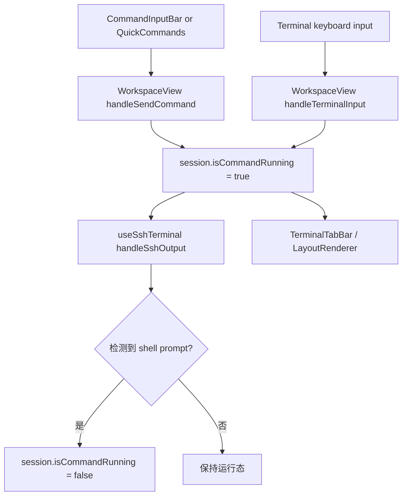

# 变更提案: terminal-running-indicator

## 元信息
```yaml
类型: 优化
方案类型: implementation
优先级: P1
状态: 进行中
创建: 2026-04-19
```

---

## 1. 需求

### 背景
当前工作区顶部的 SSH 服务器标签与终端面板内部的子终端标签，只能表达连接状态和终端数量，无法判断某个终端是否仍在执行命令。用户希望在这两层标签上增加一个轻量的“运行中”标记，优先采用 `%` 这种很接近终端语义的提示，而不是额外堆叠新的大块状态卡片。

现有前端状态链路里，`session.store` 会保留连接状态、活动会话和底部命令输入框草稿，但没有后端提供的“命令正在执行”权威字段；因此这次需求需要在不改后端协议的前提下，基于前端已有的“发送命令”和“终端输出”信号推导一个足够稳定的运行态。

### 目标
- 在 SSH 会话发送非空命令后，把对应终端标记为“运行中”。
- 在终端输出重新出现常见 shell prompt 时，自动清除该终端的“运行中”标记。
- 顶部服务器级标签在该服务器下任一终端运行时显示 `%` 标记，终端面板内部子标签只给对应终端显示 `%` 标记。
- 保持现有连接状态圆点、关闭按钮、RDP/VNC 标签行为与后端 WebSocket 协议不变。

### 约束条件
```yaml
时间约束: 本轮只做前端局部增强，保持可直接回滚
性能约束: 不引入高频全量扫描，仅在发送命令和收到终端输出时做轻量判定
兼容性约束: RDP/VNC 顶部标签继续沿用现有行为，SSH 多终端模型与 keep-alive 渲染链路不重构
业务约束: 运行态为前端派生值，不新增后端协议字段；检测不到 prompt 时允许保守依赖兜底清除
```

### 验收标准
- [ ] SSH 会话通过命令输入框、快捷命令或终端内回车发送非空命令后，对应终端标签出现 `%` 运行中标记。
- [ ] 同一 SSH 服务器下任一终端处于运行中时，顶部服务器标签同步出现 `%` 标记；运行全部结束后自动消失。
- [ ] 常见 shell prompt 返回时会清除运行中标记；`Ctrl+C`、断连或再次输入时不会把旧运行态永久残留在标签上。
- [ ] `npm --workspace @nexus-terminal/frontend run build` 通过，且没有新增模板/类型错误。

---

## 2. 方案

### 技术方案
继续复用现有 `session.store -> WorkspaceView -> terminalManager/useSshTerminal -> TerminalTabBar/LayoutRenderer` 的前端数据流，不新增后端字段，也不引入新的全局 store。具体分为三层：

1. 在 SSH `SessionState` 上补充响应式运行态字段与终端行输入缓存。
2. 在 `WorkspaceView.vue` 的命令发送与终端键入链路里，把“发送非空命令”和“Ctrl+C/回车提交”转成运行态更新。
3. 在 `useSshTerminal.ts` 的 `ssh:output` 处理链路里，对末尾输出做常见 shell prompt 判定，命中后清除运行态；同时在断连、错误等链路做兜底清理。

标签展示层只消费派生好的 `isCommandRunning` 字段：
- `TerminalTabBar.vue` 对 SSH 服务器标签按 `connectionId` 聚合，任一子终端运行时显示 `%`。
- `LayoutRenderer.vue` 对当前服务器内部终端标签逐个显示 `%`。

### 影响范围
```yaml
涉及模块:
  - frontend/session: 为 SSH 会话补充命令运行态与输入缓存字段
  - frontend/workspace: 在发送命令与终端输出链路中维护运行态
  - frontend/ui: 在顶部服务器标签与内部终端标签展示 `%` 提示
  - frontend/i18n: 补充运行中提示文案
预计变更文件: 7-9
```

### 风险评估
| 风险 | 等级 | 应对 |
|------|------|------|
| Prompt 正则误判，把普通输出误当成 shell prompt | 中 | 仅对输出末尾的最后非空行做判定，并要求匹配常见提示符结尾形态 |
| 只靠 prompt 检测时，某些交互程序或异常输出不会自动清除运行态 | 中 | 增加 `Ctrl+C`、断连、错误和再次输入时的兜底清除，允许保守回退 |
| 在终端输入链路里新增输入缓存可能影响现有输入转发 | 低 | 缓存只做本地字符串更新，不改变原有 `sendData()` 转发与 `keep-alive` 机制 |

---

## 3. 技术设计

### 架构设计


### 数据模型
| 字段 | 类型 | 说明 |
|------|------|------|
| `isCommandRunning` | `Ref<boolean>` | 当前 SSH 会话是否处于命令运行中 |
| `terminalInputBuffer` | `Ref<string>` | 终端内当前尚未提交的一行输入缓存，用于回车时判断是否发送了非空命令 |

---

## 4. 核心场景

### 场景: 底部命令输入框发送命令后出现运行中标记
**模块**: frontend
**条件**: 用户已打开某个 SSH 会话，并通过底部命令输入框、快捷命令或历史命令发送非空命令。
**行为**: `WorkspaceView.vue` 在发送数据给 `terminalManager` 前，将该会话标记为运行中。
**结果**: 顶部服务器标签和该服务器内部对应终端标签出现 `%` 标记。

### 场景: 服务器下有多个终端时聚合显示运行态
**模块**: frontend
**条件**: 同一 `connectionId` 下存在多个 SSH 终端，且其中至少一个终端仍在执行命令。
**行为**: `TerminalTabBar.vue` 对当前服务器组内终端的 `isCommandRunning` 做聚合。
**结果**: 顶部服务器级标签显示 `%`，内部子终端标签只在对应终端上显示 `%`。

### 场景: shell prompt 返回后自动清除运行态
**模块**: frontend
**条件**: 终端收到新的输出块，且末尾出现常见 shell prompt。
**行为**: `useSshTerminal.ts` 在 `ssh:output` 处理完成后清除运行态。
**结果**: `%` 标记自动消失，不需要用户手动切换标签或刷新页面。

---

## 5. 技术决策

### terminal-running-indicator#D001: 运行态继续作为前端派生状态实现，而不是扩展后端协议
**日期**: 2026-04-19
**状态**: ✅采纳
**背景**: 这次需求只涉及标签层提示，不要求服务端对命令生命周期建立权威状态机；后端当前也没有现成字段可直接复用。
**选项分析**:
| 选项 | 优点 | 缺点 |
|------|------|------|
| A: 新增后端 WebSocket 运行态字段 | 语义最权威 | 改动范围扩散到后端协议和前后端联调，超出本轮 UI 增强需求 |
| B: 复用前端发送与输出事件派生命令运行态 | 改动集中在现有前端链路，回滚简单 | 对 prompt 识别准确度有依赖 |
**决策**: 选择方案 B
**理由**: 当前目标是给标签增加“是否还在跑”的轻量感知，不是建设完整任务管理协议。前端派生方案足以满足交互需求，且改动边界与现有架构一致。
**影响**: 主要影响 `session` 派生状态、`WorkspaceView.vue`、`useSshTerminal.ts` 与两个标签组件。

### terminal-running-indicator#D002: 采用“发送非空命令置位 + 常见 prompt 清除 + 中断/断连兜底”的混合检测策略
**日期**: 2026-04-19
**状态**: ✅采纳
**背景**: 单靠“发送命令后一直高亮”会产生残留；单靠输出判定又会遗漏异常结束和交互式输入场景。
**选项分析**:
| 选项 | 优点 | 缺点 |
|------|------|------|
| A: 只要发送过命令就保持 `%`，直到下次输入再清除 | 实现最简单 | 状态滞后严重，用户很难判断命令是否真的结束 |
| B: 发送非空命令置位，常见 prompt 返回时清除，并用 `Ctrl+C` / 断连 / 新输入兜底 | 贴近真实 shell 行为，误残留更少 | 需要维护输入缓存和轻量 prompt 正则 |
**决策**: 选择方案 B
**理由**: 该策略能在不改后端的前提下最大化接近“命令结束”的真实时机，同时把无法完全识别的 shell 差异控制在可接受范围内。
**影响**: 需要在 `WorkspaceView.vue` 与 `useSshTerminal.ts` 增加少量运行态同步逻辑。

---

## 6. 成果设计

### 设计方向
- **美学基调**: 延续现有深色运维工作台，新增提示应是“终端感很强的细小信号”，而不是抢占层级的大号徽标。
- **记忆点**: 当前正在运行的标签旁边出现一个琥珀色 `%`，让用户一眼联想到 shell prompt 和命令执行现场。
- **参考**: 现有 `TerminalTabBar` / `LayoutRenderer` 终端标签样式 + 用户明确提出的 `%` 符号偏好。

### 视觉要素
- **配色**: 沿用现有绿色激活态与深色背景，`%` 使用偏琥珀/暖黄的强调色，与连接状态圆点形成层级区分。
- **字体**: 继续使用项目现有字体体系，不额外引入新字体；`%` 保持和标签文字一致的紧凑终端感。
- **布局**: `%` 放在服务器数量徽标前或终端标题后，作为紧凑 inline 状态标记，不改变现有关闭按钮区域。
- **动效**: 不新增复杂动画，仅保留轻量颜色过渡，避免把“运行中”误做成 loading spinner。
- **氛围**: 保持当前终端工作台的克制风格，让 `%` 像 shell 的即时信号灯，而不是独立组件块。

### 技术约束
- **可访问性**: `%` 标记需带 tooltip/title 文案，避免只靠颜色表达运行态。
- **响应式**: 移动端和窄宽度下优先保留 `%` 本体，不强依赖长文案。
