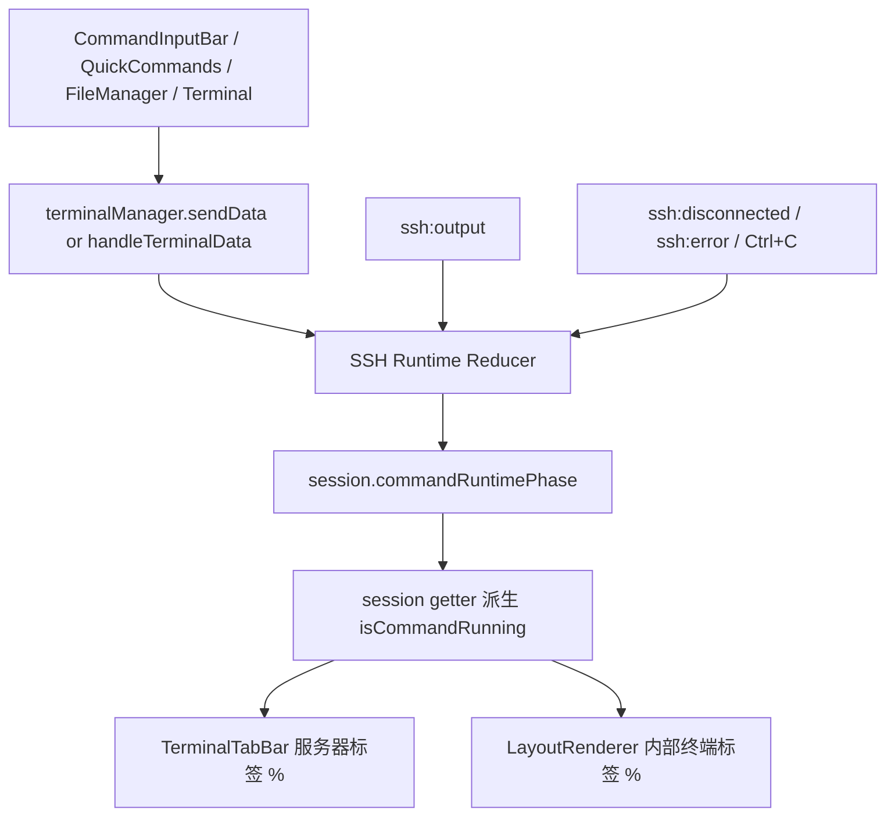

# 变更提案: ssh-terminal-runtime-state-machine

## 元信息
```yaml
类型: 修复/优化
方案类型: implementation
优先级: P1
状态: 实施中
创建: 2026-04-21
```

---

## 1. 需求

### 背景
仓库已经在 2026-04-19 做过一轮 `%` 运行中提示增强，当前 [TerminalTabBar.vue](/E:/code/vue/nexus-terminal/packages/frontend/src/components/TerminalTabBar.vue) 和 [LayoutRenderer.vue](/E:/code/vue/nexus-terminal/packages/frontend/src/components/LayoutRenderer.vue) 也已经接上了 `%` UI。但现有实现仍把运行态建模成单个 `isCommandRunning` 布尔值，再叠加 `terminalInputBuffer` 和 prompt 正则做启停判断。这个模型无法区分“刚提交命令但还没输出”“命令正在持续输出”“连接异常断开”“错误导致提前结束”等阶段，导致一些真实场景下 `%` 要么瞬时闪烁，要么被过早清掉，用户体感上接近“没有实际作用”。

### 目标
- 将 SSH 命令运行态从单个布尔值升级成显式状态机，至少能区分 `idle / typing / pending / running / disconnected / error`。
- 继续基于发送命令、shell prompt、断连与错误链路派生运行态，但收口到统一的状态转移逻辑，而不是分散地手改布尔值。
- 让顶部服务器标签和服务器内部终端标签继续显示 `%`，但由“运行态处于活动阶段”统一派生，确保两层显示一致。
- 解决“快速命令根本看不到 `%`”的问题，让极短命令也能有足够短但可感知的可视反馈。

### 约束条件
```yaml
时间约束: 本轮限定在 packages/frontend 内完成，不扩展 backend WebSocket 协议
性能约束: 继续沿用轻量字符串缓冲与尾部 prompt 检测，不引入全终端内容扫描
兼容性约束: RDP/VNC 标签行为不变，现有 WorkspaceView / Terminal / session getter 数据流尽量少破坏
业务约束: `%` 仍是前端派生提示，不承诺成为服务端权威任务状态
```

### 验收标准
- [ ] SSH 会话在底部命令输入框、快捷指令、文件管理器和终端内回车等现有发送入口触发后，会进入显式运行态活动阶段并显示 `%`
- [ ] shell prompt 返回、连接断开、SSH 错误和 `Ctrl+C` 中断后，运行态会按统一状态机退出活动阶段，顶部服务器标签和内部终端标签同步消失 `%`
- [ ] 极短命令不会因为“提交后立刻命中 prompt”而完全看不到 `%`，标签上至少存在一个可感知的短暂运行中提示
- [ ] `npm --workspace @nexus-terminal/frontend run build` 通过，且没有新增类型或模板错误

---

## 2. 方案

### 技术方案
本轮不再继续扩展旧的 `isCommandRunning` 布尔值，而是引入一层显式 SSH 运行态模型，并把发送输入、输出探测、断连和错误全部收口到同一套 reducer 风格的状态转移函数中。

实现分成三层：

1. 在 `session` 模块中新增 SSH 运行态类型与状态字段，至少包含 `phase`、`lastTransitionAt`、`lastCompletedAt` 和输入缓冲；`isCommandRunning` 改为从 `phase` 派生，而不是作为主状态独立维护。
2. 在 `useSshTerminal.ts` 中把“发送非空命令”“收到输出”“命中 prompt”“中断”“断连”“错误”统一转换成状态机事件，避免旧实现那种一边写布尔、一边清空输入缓存的分散逻辑。
3. 在标签 UI 层继续复用 `%`，但由 `isRuntimeActive(phase)` 统一判定。对于极快结束的命令，增加一个很短的最小可见窗口，让 `%` 不至于只闪过一个渲染帧。

### 影响范围
```yaml
涉及模块:
  - frontend/session: 调整 SSH 会话运行态模型与 getter 派生字段
  - frontend/composables: 重写 useSshTerminal.ts 内的运行态转移逻辑
  - frontend/ui: 顶部服务器标签与服务器内终端标签改为消费新的派生活动态
  - frontend/knowledge: 同步 frontend.md 与 CHANGELOG.md 中的运行态描述
预计变更文件: 6-8
```

### 风险评估
| 风险 | 等级 | 应对 |
|------|------|------|
| prompt 检测仍可能覆盖不到个别定制 shell | 中 | 保持 prompt 识别只负责“退出活动态”，同时由断连、错误和中断链路兜底清理 |
| 新状态机与旧 getter 混用导致 UI 不更新或语义冲突 | 中 | 收敛 getter，只保留一个派生活动态出口，模板层继续吃布尔结果以减小改动面 |
| 为了让短命令可见而增加最短展示时间后，可能让极快命令多亮几百毫秒 | 低 | 将最短窗口控制在短阈值，只解决“完全看不到”的问题，不把标签做成长时延迟态 |

---

## 3. 技术设计

### 架构设计


### 数据模型
| 字段 | 类型 | 说明 |
|------|------|------|
| `commandRuntimePhase` | `Ref<'idle' \| 'typing' \| 'pending' \| 'running' \| 'disconnected' \| 'error'>` | SSH 终端当前所处的显式运行阶段 |
| `commandRuntimeReason` | `Ref<'init' \| 'input' \| 'submit' \| 'output' \| 'prompt' \| 'interrupt' \| 'disconnect' \| 'error' \| 'connected'>` | 最近一次状态迁移的原因，便于调试与后续扩展 |
| `commandRuntimeVisibleUntil` | `Ref<number>` | 运行中提示至少显示到的时间点，用于避免极短命令完全不可见 |
| `terminalInputBuffer` | `Ref<string>` | 当前一行尚未提交的终端输入缓冲，继续用于判断回车是否提交了非空命令 |

---

## 4. 核心场景

### 场景: 快捷命令或底部命令输入框发送非空命令
**模块**: frontend
**条件**: 用户在某个 SSH 会话上通过底部命令输入框、快捷指令、命令历史或文件管理器触发 `terminalManager.sendData(...)`
**行为**: 状态机收到“提交命令”事件，切换到 `pending`，并立即打开 `%` 运行中提示
**结果**: 顶部服务器标签和当前服务器内部终端标签都能同步看到 `%`

### 场景: 命令快速结束但提示仍可见
**模块**: frontend
**条件**: 用户发送一个几乎立即返回 prompt 的短命令
**行为**: 状态机在提交后进入 `pending`，即使命中 prompt 也会遵守最短可见窗口再退出活动阶段
**结果**: `%` 不会只闪过一个渲染帧，用户能明确感知“刚刚执行过”

### 场景: shell prompt、断连和错误统一退出活动态
**模块**: frontend
**条件**: SSH 会话收到 prompt 尾部、`ssh:disconnected`、`ssh:error` 或 `Ctrl+C`
**行为**: 状态机依据事件原因切换到 `idle / disconnected / error` 等非活动阶段
**结果**: 顶部服务器标签与内部终端标签的 `%` 同步消失，不再残留旧状态

---

## 5. 技术决策

### ssh-terminal-runtime-state-machine#D001: 用显式运行态阶段替代单一 `isCommandRunning` 布尔值
**日期**: 2026-04-21
**状态**: ✅采纳
**背景**: 当前 `%` 标签虽然已经渲染到 UI，但旧实现只能用 `true/false` 表达“正在运行”，导致“刚提交命令但还没输出”“命令执行中”“连接已断开”“错误终止”等语义全部混在一个布尔值里，既难维护，也难稳定派生 UI。
**选项分析**:
| 选项 | 优点 | 缺点 |
|------|------|------|
| A: 继续沿用布尔值并追加更多 if/else | 改动最少 | 状态语义继续混乱，问题很容易回归 |
| B: 引入显式运行态阶段和统一转移函数 | 状态来源清晰，便于覆盖 prompt/断连/错误等链路 | 需要调整 session 类型和 useSshTerminal 逻辑 |
**决策**: 选择方案 B
**理由**: 用户当前反馈的根因不是“少一个 if 判断”，而是模型过弱。只有把 SSH 运行态从布尔提升为阶段状态，才能真正稳定地驱动 `%`。
**影响**: 影响 `session` 类型定义、getter 派生逻辑、`useSshTerminal.ts` 的输入/输出处理以及两个标签组件的消费方式

### ssh-terminal-runtime-state-machine#D002: 为极短命令增加最短可见窗口，而不是 prompt 一到就立刻灭掉 `%`
**日期**: 2026-04-21
**状态**: ✅采纳
**背景**: 用户明确反馈“整个没看到实际作用”，说明仅靠“提交置位、prompt 清除”的旧策略在短命令场景下可见性太差，即便逻辑成立也没有体感价值。
**选项分析**:
| 选项 | 优点 | 缺点 |
|------|------|------|
| A: prompt 命中后立即清除 `%` | 语义最直接 | 短命令常常一闪而过，用户几乎感知不到 |
| B: 运行态活动阶段增加一个很短的最小可见窗口 | 保持真实链路派生，同时确保用户能看到反馈 | 极快命令会多保留极短时间 |
**决策**: 选择方案 B
**理由**: 本轮目标不是做“理论上存在过”的状态，而是让用户真的看到 `%` 起作用。短暂的最小展示时间能显著提升感知质量，而且不需要改变后端协议。
**影响**: 需要在前端状态机里记录时间戳，并在 prompt/错误/断连清理时考虑延迟退出

---

## 6. 成果设计

N/A。本轮不新增视觉体系，只保持现有深色终端工作台内的 `%` 提示语义，并增强其可见性与状态来源准确度。
