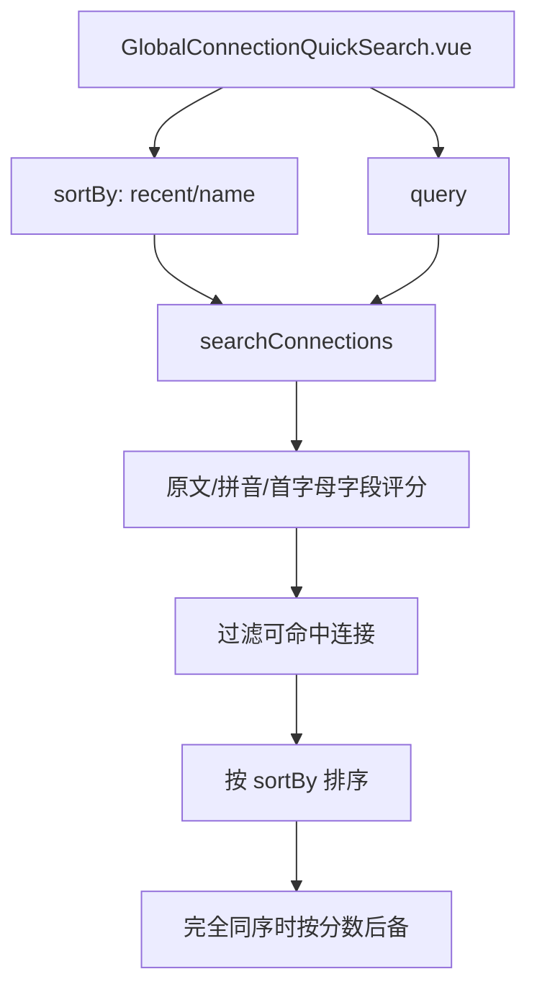

# 变更提案: global-connection-search-sort-pinyin

## 元信息
```yaml
类型: 优化
方案类型: implementation
优先级: P1
状态: 已确认
创建: 2026-05-04
```

---

## 1. 需求

### 背景
全局服务器检索已支持 `Ctrl+Shift+F` 打开，并通过 `GlobalConnectionQuickSearch.vue` 与 `utils/connectionSearch.ts` 在本地对连接名称、主机、用户名、类型和标签做模糊检索。当前默认排序已经偏向 `last_connected_at`，但用户缺少显式切换排序方式的入口；同时中文连接名称无法用拼音首字母或拼音前缀检索，例如“标准型”无法通过 `biaoz` 命中。

### 目标
- 在全局服务器检索弹窗中加入“最近连接 / 名称”两项 Tab 式排序控件。
- 默认排序为“最近连接”。
- “名称”排序按连接显示名升序排列，并在搜索命中后作为当前排序依据。
- 搜索支持中文拼音模糊匹配，至少覆盖“标准型”可通过 `biaoz` 命中的场景。
- 保持现有方向键、Enter 连接、Esc 关闭和标签检索行为。

### 约束条件
```yaml
时间约束: 当前任务内完成实现与验证
性能约束: 在浏览器本地对连接列表执行轻量匹配，不引入重型搜索服务
兼容性约束: 继续使用 Vue 3、Pinia、vue-i18n 和现有 Tailwind/主题变量
业务约束: 不改后端接口，不改连接数据模型，不引入新的 UI 框架
```

### 验收标准
- [ ] 打开全局服务器检索时默认选中“最近连接”，空查询结果按 `last_connected_at` 降序展示，未连接项靠后。
- [ ] 点击“名称”后，空查询结果按连接显示名升序展示。
- [ ] 输入中文连接名对应的拼音前缀或连续拼音片段可命中结果，例如“标准型”可由 `biaoz` 命中。
- [ ] 方向键、Enter、Esc 和鼠标选择仍正常工作。
- [ ] `npm run build --workspace packages/frontend` 通过。

---

## 2. 方案

### 技术方案
在 `connectionSearch.ts` 中扩展 `ConnectionSearchOptions`，加入 `sortBy: 'recent' | 'name'`，并把空查询排序与搜索结果排序都收敛到同一排序函数。新增轻量中文转拼音索引函数，对搜索字段生成原文、拼音全拼、拼音首字母三类匹配文本；拼音数据内置常见汉字映射，并覆盖本次验收样例“标准型”。在 `GlobalConnectionQuickSearch.vue` 中加入排序状态和两个按钮式 Tab，默认 `recent`，点击后保留当前查询并重新排序结果。

### 影响范围
```yaml
涉及模块:
  - frontend: 全局服务器检索弹窗、连接搜索工具和多语言文案
预计变更文件: 5
```

### 风险评估
| 风险 | 等级 | 应对 |
|------|------|------|
| 内置拼音映射无法覆盖所有中文字符 | 中 | 先覆盖常用汉字与当前样例；未覆盖字符保留原文，不影响既有中文直接搜索 |
| 排序切换影响搜索相关性 | 低 | 查询命中后先按当前排序模式排列，匹配分数仅作为完全同序时的后备 |
| UI 控件挤压弹窗标题区 | 低 | 使用紧凑分段控件，移动端允许标题区换行 |

### 方案取舍
```yaml
唯一方案理由: 现有检索已经集中在一个工具函数和一个弹窗组件，直接扩展本地搜索与排序最小且可回滚，不需要后端接口或数据库变更。
放弃的替代路径:
  - 引入完整拼音库: 覆盖更全，但会增加依赖和包体积；当前需求只要求本地模糊搜索且已有构建负担。
  - 后端搜索接口: 能统一服务端排序，但会扩大改动到 API、数据库和权限链路，不符合本次局部交互优化范围。
回滚边界: 可独立回退 GlobalConnectionQuickSearch.vue、connectionSearch.ts 和 locale 文案改动，不影响连接管理和连接建立链路。
```

---

## 3. 技术设计

### 搜索排序流程


### 数据模型
| 字段 | 类型 | 说明 |
|------|------|------|
| `ConnectionSearchSortBy` | `'recent' \| 'name'` | 全局搜索结果排序模式 |
| `ConnectionSearchOptions.sortBy` | `ConnectionSearchSortBy` | 控制空查询和搜索命中后的结果排序 |

---

## 4. 核心场景

### 场景: 全局服务器检索排序与拼音检索
**模块**: frontend  
**条件**: 用户已登录，按 `Ctrl+Shift+F` 打开全局服务器检索。  
**行为**: 用户可在“最近连接 / 名称”之间切换排序；输入连接名、主机、用户名、类型、标签或中文名称拼音片段进行检索。  
**结果**: 默认展示最近连接优先；切到名称后按名称展示；中文名称支持拼音模糊命中，选中结果后继续复用现有连接链路。

---

## 5. 技术决策

### global-connection-search-sort-pinyin#D001: 使用本地轻量拼音索引扩展现有搜索
**日期**: 2026-05-04  
**状态**: ✅采纳  
**背景**: 用户要求快速补足全局搜索排序与中文拼音模糊搜索，现有搜索已在前端本地完成。  
**选项分析**:
| 选项 | 优点 | 缺点 |
|------|------|------|
| A: 扩展本地搜索工具 | 改动集中、响应快、不改 API | 拼音覆盖依赖内置映射 |
| B: 引入拼音库 | 覆盖更完整 | 新增依赖和包体积，需额外版本风险评估 |
| C: 后端搜索接口 | 服务端统一排序 | 影响范围扩大到后端、接口和缓存 |
**决策**: 选择方案 A。  
**理由**: 当前需求是前端全局检索弹层交互优化，本地扩展能保持最小影响面，并与已有 `last_connected_at` 数据源兼容。  
**影响**: `GlobalConnectionQuickSearch.vue`、`connectionSearch.ts` 和 locale 文案。

---

## 6. 验证策略

```yaml
verifyMode: review-first
reviewerFocus:
  - packages/frontend/src/utils/connectionSearch.ts 的排序稳定性与拼音匹配边界
  - packages/frontend/src/components/GlobalConnectionQuickSearch.vue 的键盘交互是否回归
testerFocus:
  - npm run build --workspace packages/frontend
  - 手工或最小脚本验证“标准型”通过 biaoz 命中
uiValidation: optional
riskBoundary:
  - 不修改后端接口
  - 不修改连接数据模型
  - 不引入新依赖
```

---

## 7. 成果设计

### 设计方向
- **美学基调**: 紧凑运维控制台。排序控件作为搜索标题区的分段控制，不做装饰性卡片，保持快速扫视与键盘优先。
- **记忆点**: “最近连接 / 名称”两项像命令面板过滤器一样贴近搜索输入，用户打开弹窗即可判断当前排序依据。
- **参考**: 项目现有全局检索弹窗、连接管理页排序文案和主题变量。

### 视觉要素
- **配色**: 沿用 `bg-background`、`bg-header`、`text-foreground`、`text-text-secondary`、`border-border`、`primary` 等现有主题变量。
- **字体**: 沿用项目主题字体变量，不在局部组件额外引入字体。
- **布局**: 标题与排序控件同层布局，窄屏自然换行；输入框仍占据主视觉行。
- **动效**: 分段控件使用现有 `transition-colors`，不增加复杂动画。
- **氛围**: 保持弹窗本身的工具面板质感和现有阴影层级。

### 技术约束
- **可访问性**: 排序控件使用 `button` 与 `aria-pressed`，可键盘 Tab 聚焦。
- **响应式**: 标题区允许 `flex-wrap`，排序按钮不挤压标题文本。
