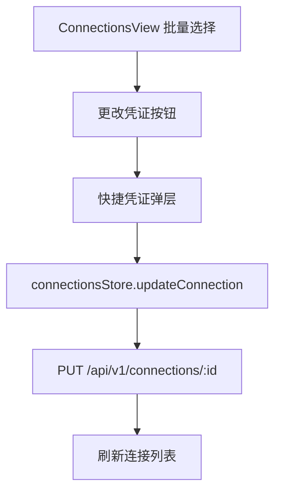

# 变更提案: bulk credential shortcut

## 元信息
```yaml
类型: 新功能
方案类型: implementation
优先级: P1
状态: 已设计
创建: 2026-05-13
```

---

## 1. 需求

### 背景
连接管理页已有批量修改模式，也已有 `BatchEditConnectionForm.vue` 支持批量应用已保存登录凭证；但用户需要“全选后直接更改为某个凭证”的快捷入口，现有路径需要先打开完整批量编辑弹窗，再展开认证区并选择凭证，操作层级偏深。

### 目标
- 在连接/主机列表的批量操作区增加“更改凭证”快捷按钮。
- 用户全选或多选连接后，可直接选择某个已保存登录凭证并批量绑定到选中连接。
- 保持现有约束：已保存登录凭证只能批量应用到同一种连接类型；混选类型时给出明确提示。
- 复用现有连接更新接口与 Pinia store，不新增后端数据模型。

### 约束条件
```yaml
时间约束: 无
性能约束: 避免新增全量复杂轮询；批量更新完成后统一刷新连接列表
兼容性约束: 保留现有批量编辑弹窗和单连接编辑行为
业务约束: 已保存凭证按 SSH/RDP/VNC 类型过滤，不允许跨类型应用非空凭证
```

### 验收标准
- [ ] 批量模式下选择至少 1 个连接后，“更改凭证”按钮可用。
- [ ] 选中同一种类型连接时，快捷弹层只展示该类型的已保存凭证。
- [ ] 选择凭证并确认后，选中连接的 `login_credential_id` 更新为目标凭证。
- [ ] 混选多种连接类型时，弹层禁止选择非空凭证并展示类型限制提示。
- [ ] 可选择“取消已保存凭证”将选中连接的 `login_credential_id` 清空。
- [ ] 更新成功后关闭弹层、清空本次选择并刷新连接列表。

---

## 2. 方案

### 技术方案
在 `ConnectionsView.vue` 中新增一个轻量快捷凭证弹层状态和提交逻辑：
- 批量工具条新增“更改凭证”按钮，复用当前 `selectedConnectionIdsForBatch`。
- 通过已选连接计算 `selectedBatchConnections`、`selectedBatchConnectionTypes` 和 `availableBatchLoginCredentials`。
- 弹层内使用原生 `select` 展示“请选择凭证 / 取消已保存凭证 / 同类型凭证列表”，避免引入新依赖。
- 提交时循环调用现有 `connectionsStore.updateConnection(id, { login_credential_id })`，沿用后端 `updateConnection` 的类型校验和凭证快照逻辑。
- 成功后复用 `showAlertDialog` 给出结果，清空选择并刷新连接列表。

### 影响范围
```yaml
涉及模块:
  - frontend: 连接管理页批量工具条、快捷凭证弹层、多语言文案
  - knowledge: 更新前端模块文档和 CHANGELOG
预计变更文件: 5
```

### 风险评估
| 风险 | 等级 | 应对 |
|------|------|------|
| 混选不同类型连接时误绑定凭证 | 中 | 按已选连接类型计算可用凭证；非空凭证仅允许单一连接类型 |
| 批量更新部分成功部分失败 | 中 | 记录成功数，失败时保留错误提示；最终刷新连接列表避免本地状态漂移 |
| 快捷入口与完整批量编辑弹窗能力重复 | 低 | 快捷入口只覆盖 `login_credential_id`，完整弹窗继续承载端口、用户、代理、标签、备注等高级能力 |

### 方案取舍
```yaml
唯一方案理由: 复用现有连接更新接口和批量选择状态，改动集中在连接页，能以最小后端风险满足“全选后直接改凭证”的核心需求。
放弃的替代路径:
  - 新增后端 bulk credential API: 当前批量编辑已通过现有 updateConnection 链路工作，新增 API 会扩大后端影响面，收益有限。
  - 修改 BatchEditConnectionForm 作为唯一入口: 无法满足用户要求的快捷按钮和直接选择路径。
  - 在登录凭证管理页反向批量改绑: 用户已确认入口为连接/主机列表，不纳入本次范围。
回滚边界: 回退 ConnectionsView.vue 中新增的快捷弹层与按钮，并移除对应 locale 和知识库记录即可；后端与数据表无变更。
```

---

## 3. 技术设计

### 架构设计


### API设计
本方案不新增 API，继续使用：

#### PUT /api/v1/connections/:id
- **请求**: `{ "login_credential_id": number | null }`
- **响应**: `{ message: string, connection: ConnectionInfo }`

### 数据模型
不新增数据表或字段。继续使用 `connections.login_credential_id`。

---

## 4. 核心场景

### 场景: 批量快捷更改登录凭证
**模块**: frontend  
**条件**: 用户进入连接管理页，开启批量修改并选择一个或多个连接。  
**行为**: 用户点击“更改凭证”，在弹层中选择同类型已保存凭证或选择清空已保存凭证，然后确认。  
**结果**: 选中连接批量更新 `login_credential_id`，页面刷新后连接卡片显示新的登录凭证。

---

## 5. 技术决策

### bulk-credential-shortcut#D001: 使用前端快捷入口复用现有连接更新链路
**日期**: 2026-05-13  
**状态**: ✅采纳  
**背景**: 现有批量编辑已支持登录凭证更新，但入口较深；用户要求“全选后直接更改为某个凭证”。  
**选项分析**:
| 选项 | 优点 | 缺点 |
|------|------|------|
| A: 在连接页新增快捷弹层并复用 `updateConnection` | 改动集中、后端风险低、直接满足快捷操作 | 多连接仍是逐条请求 |
| B: 新增后端批量凭证 API | 请求数更少，后端可事务化 | 需要新增 controller/service/repository，影响面扩大 |
| C: 只优化现有批量编辑弹窗 | 复用最多 | 仍不够快捷，不符合用户确认的入口 |
**决策**: 选择方案 A  
**理由**: 本次功能是已有能力的快捷入口，现有后端已校验凭证类型并更新连接，复用它能降低安全和数据一致性风险。  
**影响**: 前端连接管理页新增快捷 UI 和批量提交逻辑；后端无结构变更。

---

## 6. 验证策略

```yaml
verifyMode: review-first
reviewerFocus:
  - packages/frontend/src/views/ConnectionsView.vue 中批量选择状态与快捷弹层状态是否一致
  - login_credential_id 的 null / number / 未选择三态是否区分清楚
  - 混选连接类型时是否阻止非空凭证应用
testerFocus:
  - npm run build --workspace packages/frontend
  - 手工检查批量模式: 全选 -> 更改凭证 -> 选择凭证 -> 保存
  - 手工检查混选 SSH/RDP/VNC 时的限制提示
uiValidation: optional
riskBoundary:
  - 不新增后端批量接口
  - 不改变登录凭证管理页的数据模型和删除行为
```

---

## 7. 成果设计

### 设计方向
- **美学基调**: 延续项目现有 Apple-inspired 管理台风格，采用低噪声工具弹层、圆角 8-12px、单一蓝色交互强调。
- **记忆点**: 批量工具条中出现独立钥匙按钮，弹层只聚焦“选凭证并应用”一个动作。
- **参考**: 项目 `DESIGN.md` 与现有 `ConnectionsView.vue` 工具条视觉。

### 视觉要素
- **配色**: 复用 `bg-background`、`bg-card`、`text-foreground`、`text-text-secondary`、`bg-button` 和 `text-button-text` 主题 token。
- **字体**: 沿用项目已有字体栈和 Tailwind 文本尺寸，不为单个弹层引入新字体。
- **布局**: 居中模态弹层，顶部标题，中部选择控件和已选摘要，底部取消/应用按钮。
- **动效**: 使用现有 hover/focus/disabled 状态，不新增复杂动画。
- **氛围**: 轻边框、紧凑留白，与连接管理页现有弹窗保持一致。

### 技术约束
- **可访问性**: 按钮有 `title`，选择框有 `label`，禁用态明确。
- **响应式**: 弹层最大宽度不超过 `max-w-md`，小屏使用 `p-4` 保持可操作。
